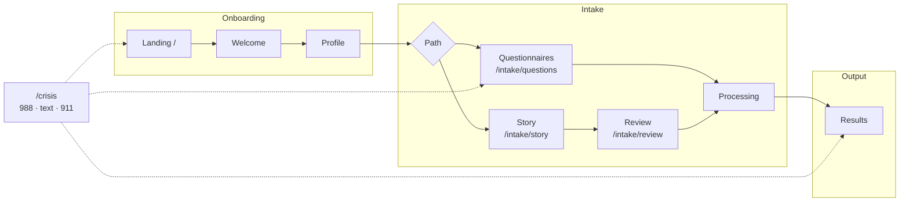
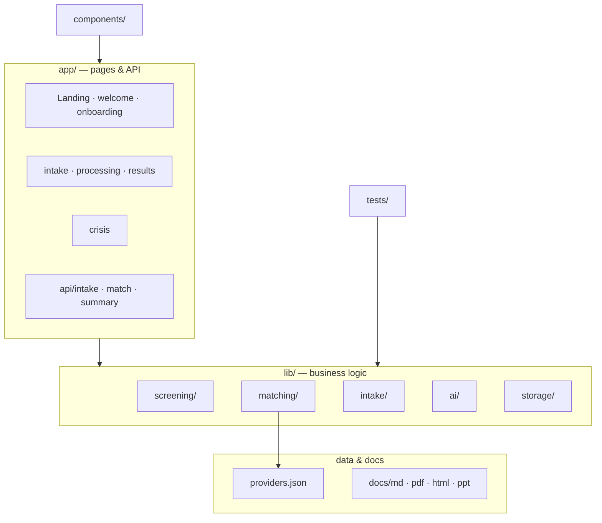
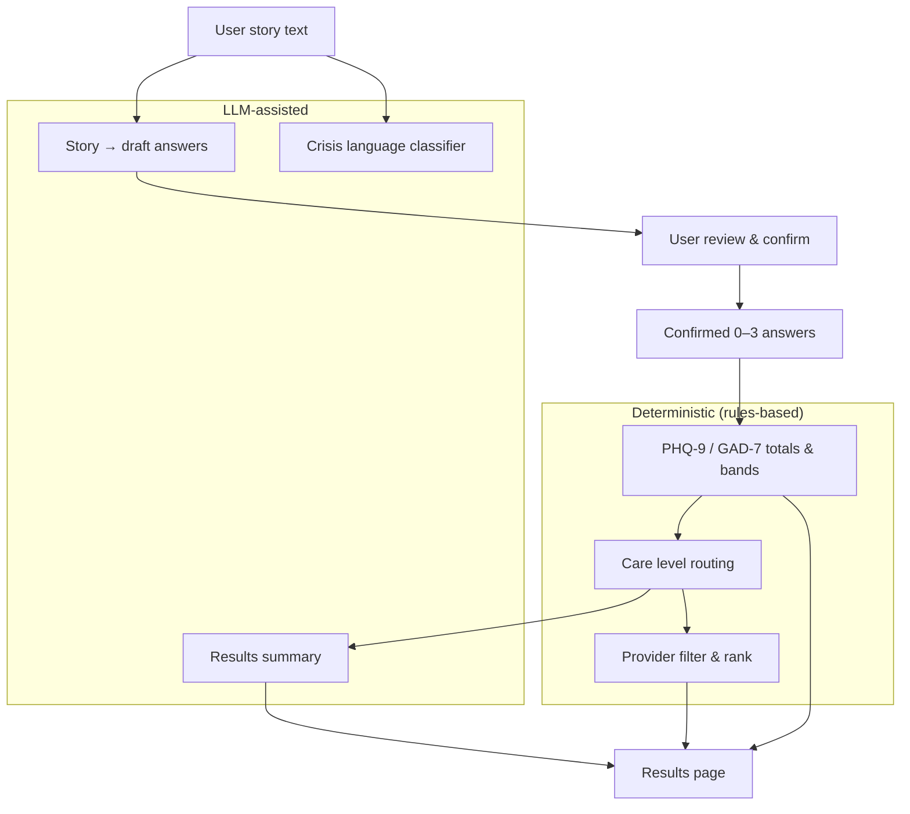

# ClearPath

**AI-assisted mental health triage and provider matching** — validated PHQ-9 and GAD-7 screening, stepped care guidance, and a ranked provider shortlist. Screening output is non-diagnostic; clinical scores are computed by rules, not by the language model.

**Live prototype:** https://clearpathcare-demo.vercel.app

---

## What this product does

ClearPath helps someone move from “I need help” to a concrete next step in one session:

1. **Profile** — ZIP, insurance, concern, and care format (telehealth / in-person).
2. **Screening** — answer PHQ-9 and GAD-7 directly, *or* share a story and review AI-suggested draft answers before anything is scored.
3. **Results** — severity bands, care level (self-guided through crisis), matched providers, and a plain-language summary.

Crisis signals (PHQ-9 item 9 or high-risk language) surface **988, Crisis Text Line, 911, and `/crisis`** inline. Screening is **not** hard-stopped — users still receive a care plan and provider list.

For strategy, research, and full requirements, see **`docs/`** (Product Dossier, SRS, Research Dossier, presentation).

---

## User journey



Crisis resources are available at any step without blocking screening.

---

## MVP scope

| In scope (this repo) | Out of scope (later phases) |
|----------------------|-----------------------------|
| PHQ-9 + GAD-7 intake (questionnaire or story path) | Live provider directory or booking |
| Deterministic scoring and care-level routing | User accounts or employer admin |
| Seeded provider matching (`data/providers.json`) | Persistent records across sessions |
| Crisis resources and non-blocking safety UX | Insurance verification or payments |
| Print/save results | |

Session data lives in the browser tab (`sessionStorage`) and in server memory for the active session only.

---

## Get started

### Prerequisites

- **Node.js** 20+
- **pnpm** 10+ (`npm install -g pnpm` if needed)

### Clone and run

```bash
git clone <repository-url>
cd clearpath
pnpm install
cp .env.example .env.local
pnpm dev
```

Open **http://localhost:3000**.

### Environment (`.env.local`)

| Variable | Purpose |
|----------|---------|
| `LLM_PROVIDER` | `huggingface`, `openai`, or `openrouter` |
| `LLM_API_KEY` | API key for the chosen provider |
| `LLM_BASE_URL` | Provider API base URL |
| `LLM_MODEL` | Model id (see `.env.example`) |

**Questionnaire-only demos work without LLM keys.** Story intake, crisis classification on free text, and the results narrative require a configured provider.

### Verify the build

```bash
pnpm test      # unit tests (scoring, matching, intake flow)
pnpm build     # production build
pnpm lint      # ESLint
```

---

## Project structure



```
clearpath/
├── app/                    # Pages and API routes (Next.js App Router)
│   ├── page.tsx            # Landing
│   ├── welcome/            # Four-step overview
│   ├── onboarding/         # Profile wizard
│   ├── intake/             # Path choice, questions, story, review
│   ├── processing/         # Score → match → summary progress UI
│   ├── results/            # Care plan and provider shortlist
│   ├── crisis/             # Standalone crisis resources page
│   └── api/                # REST handlers (start, batch, score, match, …)
├── components/             # UI (intake, results, layout, shared safety copy)
├── data/
│   ├── providers.json      # Seeded provider dataset for matching
│   └── provider-meta.ts    # Dataset currency date (demo data)
├── docs/
│   ├── md/                 # Authoritative specs (Markdown)
│   ├── pdf/                # Exported PDFs
│   ├── html/               # Exported HTML
│   └── ppt/                # Presentation deck
├── lib/
│   ├── screening/          # Scoring, bands, care level, crisis checks
│   ├── matching/           # Provider filter and rank logic
│   ├── intake/             # Flow, instruments, finalize pipeline
│   ├── ai/                 # LLM prompts, story inference, summary
│   ├── storage/            # Server session + browser sessionStorage
│   └── types.ts            # Shared TypeScript types
└── tests/                  # Vitest unit tests
```

### API surface

| Route | Role |
|-------|------|
| `POST /api/intake/start` | Create session, optional crisis check on profile text |
| `POST /api/intake/batch` | Save questionnaire batch answers |
| `POST /api/intake/infer-story` | Map story text to draft item values |
| `POST /api/intake/review-submit` | Confirm story-path answers |
| `GET /api/intake/session` | Resume session state |
| `POST /api/intake/score` | Deterministic PHQ-9 / GAD-7 scoring |
| `POST /api/match` | Rank providers from profile + score |
| `POST /api/summary` | Plain-language results narrative (with fallback) |

---

## AI vs deterministic logic



| User-facing output | How it is produced |
|--------------------|--------------------|
| PHQ-9 / GAD-7 totals and severity bands | Fixed rules in `lib/screening/scoring.ts` |
| Care level (therapy, psychiatry, crisis, …) | Fixed mapping from scores + item 9 |
| Provider shortlist | Filter and rank over `data/providers.json` |
| Story → draft answers | LLM (`/api/intake/infer-story`); user must confirm on review |
| Crisis language on free text | Keywords + optional LLM classifier |
| Results summary paragraph | LLM (`/api/summary`); static fallback if unavailable |

The language model never assigns numeric clinical scores.

---

## Documentation

Authoritative content is in **`docs/md/`**. HTML exports in **`docs/html/`** are used to generate the PDFs in **`docs/pdf/`**.

| Document | Markdown | HTML / PDF |
|----------|----------|------------|
| Product and business case | `docs/md/ClearPath_Product and Business Dossier.md` | `docs/html/` · `docs/pdf/` |
| Software requirements (FR/NFR, architecture) | `docs/md/ClearPath_Software Requirements Specification (SRS).md` | `docs/html/` · `docs/pdf/` |
| Research and citations | `docs/md/ClearPath_Primary Research Dossier.md` | `docs/html/` · `docs/pdf/` |
| Presentation | `docs/md/ClearPath_Presentation..md` | `docs/pdf/ClearPath_Presentation.pdf` |
| Brand guidelines | `docs/md/brand.md` | — |

---

## Safety

- UI and summary prompts state **screening, not diagnosis**.
- Story-path values enter scoring only after explicit user confirmation.
- PHQ-9 item 9 ≥ 1 always sets crisis care level; users can still complete intake and view matches.
- `/crisis` loads independently of the main app flow.

---

## Stack

Next.js 16 (App Router) · React 19 · TypeScript · Tailwind CSS · Vitest · Vercel
