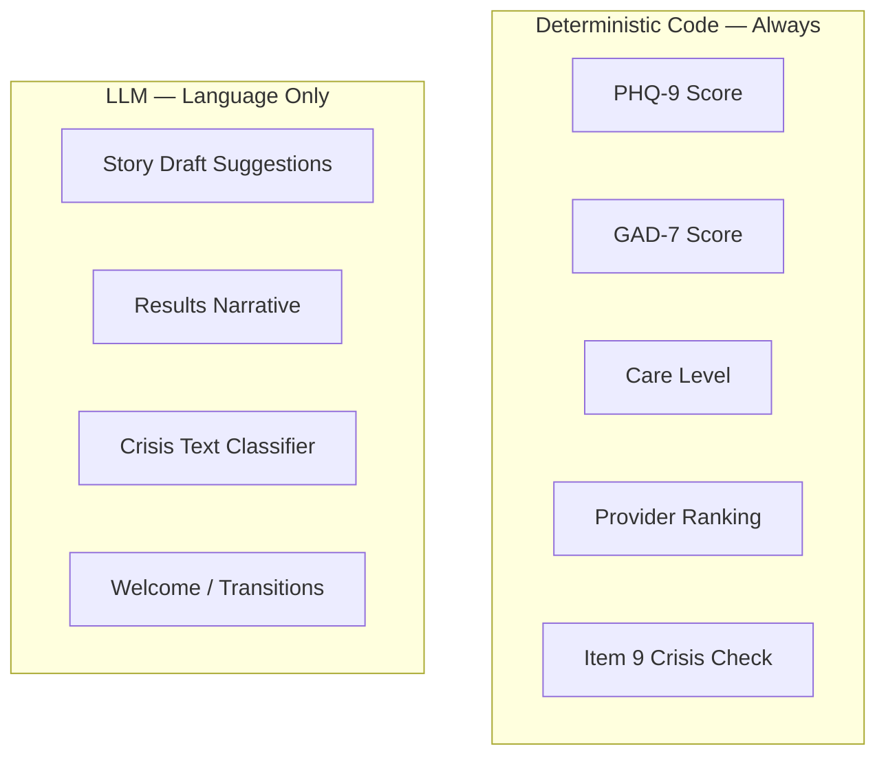
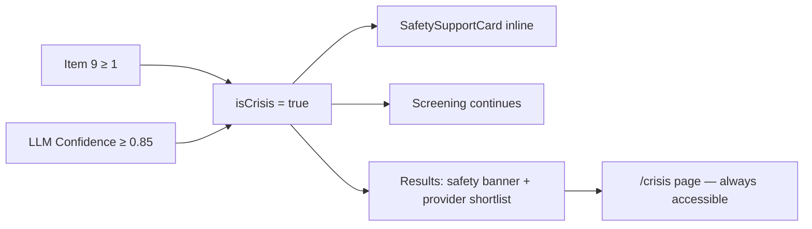

# ClearPath — PPT.md

## Slide Presentation Outline
### Take-Home MVP Product Design Assignment
**Bilisuma Tadesse | June 4, 2026**

---

## SLIDE 1 — Title

**Title:** ClearPath

**Subtitle:** AI-Powered Mental Health Triage and Provider-Match Platform

**Presenter:** Bilisuma Tadesse

**Date:** June 4, 2026

**Tagline:** From "I need help" to the right provider — in minutes, not weeks.

---

## SLIDE 2 — The Problem

**Title:** The System Fails People Who Are Already Trying

**Headline stat:** 29.5 million Americans with a diagnosed mental illness received no treatment in 2024.

**The gap is not awareness. It is access.**

When someone decides today to seek help, they encounter:

- No structured way to understand what type of care they need
- Average wait of 48 days for a first appointment at community mental health centers
- Only ~18.5% of psychiatrists currently accepting new patients
- 1 in 3 privately insured people unable to find an in-network therapist
- Insurance costs often unknown until after the first visit

**The result:** People abandon the process — not because they stopped wanting help, but because the system provides no intelligent path forward.

---

## SLIDE 3 — The User

**Title:** Who Is Being Left Behind

**Primary user:**

- Age 25–45, employed, insured
- Experiencing mild-to-moderate anxiety or depression
- Has already tried to find help — and hit walls
- Needs fast, personalized guidance, not generic information
- Reachable through their employer's benefit program

**Why this user matters:**

This is the largest, most commercially reachable underserved population. They are not in acute crisis — but without a structured path to care, many will become so. Their untreated condition is also the primary driver of measurable workplace productivity loss.

**This is not a crisis intervention product. It is the layer that prevents crises from developing.**

---

## SLIDE 4 — Stakeholders and System Overview

**Title:** Who Is Affected and What Each Party Needs

| Stakeholder | Core Need | What ClearPath Addresses |
|---|---|---|
| **Patients / Employees** | Fast, matched, affordable care | Eliminates the unstructured search; surfaces the right provider in minutes |
| **Employers / HR** | Productive workforce; measurable benefit ROI | Connects employees to care before productivity loss compounds |
| **Health Insurers** | Reduced avoidable ED visits; parity compliance | Provides structured triage evidence and step-appropriate routing |
| **Therapists / Providers** | Full caseloads with well-matched patients | Pre-qualified referrals matched by clinical need and insurance |
| **Regulators (FDA)** | Non-diagnostic scope; validated instruments | Screening tool, not diagnostic; deterministic scoring; no clinical claims |

**Key system constraints ClearPath respects:**

- PHQ-9 and GAD-7 are screening instruments, not diagnostic tools
- Diagnosis and treatment are deferred to licensed providers
- No PHI stored in MVP1; no HIPAA-covered relationships in the prototype phase
- Regulatory posture: FDA General Wellness, not Software as a Medical Device

---

## SLIDE 5 — The MVP

**Title:** What ClearPath Builds First — and What It Does Not

**The core loop (built in 7 days):**

1. User builds a short profile — ZIP code, insurance, primary concern, format preference
2. User completes structured PHQ-9 and GAD-7 screening (verbatim validated items)
3. System scores deterministically — the AI never computes a clinical number
4. System maps scores to a stepped-care recommendation
5. System returns a ranked shortlist of matched, in-network providers
6. A plain-language, non-diagnostic summary helps the user understand their results

**What is intentionally excluded from MVP1:**

- Real-time provider availability data (seeded dataset only)
- User accounts and persistent sessions
- Live insurance eligibility verification
- Employer dashboard
- Booking or scheduling integration
- HIPAA-compliant data architecture
- Multi-language support

**Key tradeoffs:**

- Speed vs. real data: seeded provider data proves the match loop without requiring live API integrations
- Safety vs. completeness: crisis detection and deterministic scoring are non-negotiable Must-Haves; cosmetic features are deferred
- Scope vs. quality: features are cut, not corners

---

## SLIDE 6 — The AI Feature

**Title:** AI as a Precision Triage Engine — Not a Chatbot

**What the AI does:**

ClearPath uses AI in four specific, bounded functions — none of which involve clinical scoring:

1. **Journey guidance:** Warm welcome copy, chapter transitions, and context-aware framing reduce drop-off compared to a cold 16-item form
2. **Empathetic context:** Optional free-text narrative is used to personalize the results summary and run the crisis classifier
3. **Severity-sensitive matching:** PHQ-9 scores, GAD-7 scores, and stated concern combine into a multi-dimensional clinical profile, enabling precision matching rather than keyword lookup
4. **Real-time crisis detection:** The classifier monitors free-text input for indirect crisis language, supplementing the deterministic PHQ-9 item 9 check

**What the AI never does:**

- Computes or reports PHQ-9 or GAD-7 totals
- Assigns a severity band or care level
- Makes a diagnostic claim
- Provides therapy or clinical advice

**Why AI is structurally necessary:**

A static 16-question form plus a keyword-matched directory already exists. It fails users systematically. AI enables the guided pacing, semantic understanding, and real-time safety monitoring that a form cannot provide.

**The safety guarantee:** All clinical scoring is deterministic code. The LLM receives language tasks only. This eliminates hallucination risk from every clinical output.

---

## SLIDE 7 — Business Model

**Title:** A Buyer-Present Market with Measurable ROI

**Phase 1 — Employer B2B SaaS (Months 1–6)**

- Product is free to employees; purchased by HR/Benefits teams
- Pricing: $3–8 per employee per month (PEPM)
- Target: 200–5,000 employee companies (mid-market)
- Avoid Fortune 500 in Year 1 (longer sales cycles)

**Why employers pay:**

- Poor employee mental health costs ~$47.6 billion/year in unplanned absences
- Depression-related lost productivity costs ~$44 billion/year
- One 500-person company at $65K average salary: a 5% productivity recovery = ~$163K/year recovered against a ~$30K/year ClearPath cost — approximately a 5:1 ROI

**Phase 2 — Insurer / Health Plan (Months 6–18)**

- Per-member-per-month or per-completed-referral fee
- Value: reduced avoidable ED visits; structured triage for parity compliance

**Phase 3 — Provider Network (Months 18–36)**

- Premium directory placement or per-booked-appointment referral fees
- Requires conflict-of-interest governance to protect match integrity

**Competitive gap ClearPath fills:**

Enterprise platforms (Spring Health, Lyra) serve Fortune 500. Consumer apps (BetterHelp, Woebot) serve individuals without validated triage. No product serves the mid-market employer with validated clinical intake, deterministic scoring, and multi-provider routing at accessible price points.

---

## SLIDE 8 — System Architecture and User Flow

**Title:** How ClearPath Works End to End

**Full user flow:**

**AI vs. deterministic responsibility split:**

**Crisis detection flow:**

---

## SLIDE 9 — Week 1 Snapshot

**Title:** What One Week Proved

**Live prototype:** https://clearpathcare-demo.vercel.app

**GitHub:** https://github.com/bilitade/clearpath

**The core loop is working.** In 7 days, a user can go from zero context to a ranked, matched provider shortlist — safely, in under 7 minutes.

**Built and live:**

- Profile intake → validated PHQ-9 + GAD-7 screening → deterministic scoring → stepped-care recommendation → matched provider shortlist
- Dual-layer crisis detection (deterministic item 9 check + LLM classifier) with non-blocking safety UX
- Optional story path: AI drafts item suggestions; user confirms each before any score is computed
- Plain-language results summary generated by LLM; deterministic fallback if LLM is unavailable

**Stack:** Next.js + TypeScript · Tailwind CSS · Vitest (50 tests) · Vercel

**What this is not yet:**

- Real provider data (seeded dataset only)
- User accounts or persistent sessions
- Employer dashboard
- Clinical validation by licensed advisors

**The week-1 prototype answers one question: does the core loop work?**
It does. Everything from here is validation and scaling.

---

## SLIDE 10 — 30-Day Roadmap

**Title:** From Proof of Concept to Pilot-Ready

**Week 2 — Make the Data Real**

- Replace seeded providers with NPPES NPI registry data (~500 providers, 5 metro areas)
- Geocoding + insurance enrichment pipeline
- Goal: every result card links to a real, contactable provider

**Week 3 — Get Clinical Sign-Off**

- Engage 2–3 licensed clinicians to review intake pacing, care-level mapping, and crisis detection logic
- Validate that PHQ-9/GAD-7 presentation meets clinical standards
- Document findings as a regulatory and sales transparency artifact

**Week 4 — Land the First Employer**

- Build aggregate-only employer dashboard: completion rate, care-level distribution, time-to-match
- Sign first mid-market employer pilot (200+ employees)
- Begin measuring time-to-first-appointment against the 48-day national baseline

**Months 2–4 — Close the Loop**

- Provider referral and notification (closed-loop attribution → insurer monetization)
- Live insurance eligibility verification
- Booking handoff to provider scheduling
- Opt-in longitudinal tracking: 30-day re-screen, trend view for users

**Success metrics at Day 30:**

| Metric | Target |
|---|---|
| Intake completion rate | > 65% |
| Provider match click-through | > 35% |
| Real provider coverage | ≥ 500 providers, 5 metros |
| Clinical advisory validation | Complete |
| Employer pilots signed | ≥ 1 |
| Time-to-first-appointment vs. baseline | Measurably below 48 days |

---

## SLIDE 11 — Conclusion

**Title:** The Right Problem, the Right Scope, the Right Time

**The insight:**

The failure in U.S. mental healthcare is not that people do not want help. It is that the system has no intelligent layer to convert that intent into care. ClearPath is that layer.

**What was proven in 7 days:**

A motivated user can go from "I need help" to a ranked shortlist of matched, in-network providers — in under 7 minutes — safely, without a single diagnostic claim, and with dual-layer crisis protection active throughout.

**The market opportunity:**

- 29.5 million untreated adults with diagnosed mental illness
- $47.6 billion/year in employer absence costs from poor mental health
- A mid-market employer segment (200–5,000 employees) with no validated triage product at accessible price points
- A buyer (HR/Benefits) with measurable ROI and an active budget for mental health benefits

**The path forward is concrete:**

One pilot employer at 500 employees = $2,500 MRR. Ten pilots = $25,000 MRR. The infrastructure built in this 7-day prototype is not throwaway work — every future feature (longitudinal tracking, booking, employer dashboards, insurer integration) is additive to the same core loop.

**ClearPath: from weeks to minutes. Safely.**

---

## SLIDE 12 — Thank You

**Title:** Thank You

**Subtitle:** ClearPath — AI-Powered Mental Health Triage and Provider-Match Platform

**Presenter:** Bilisuma Tadesse

**Live prototype:** https://clearpathcare-demo.vercel.app

**Questions?**

---

*End of PPT.md*

*Document prepared by Bilisuma Tadesse | Take-Home Product Design Assignment | June 4, 2026*
