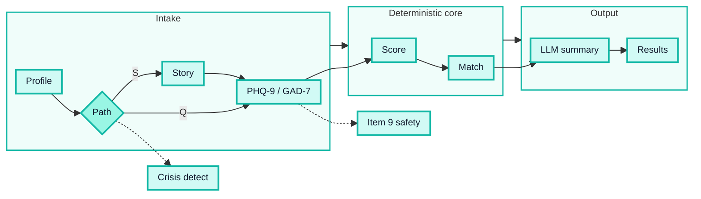
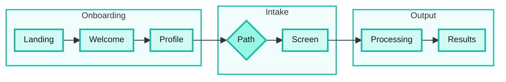

# ClearPath

**Prepared by:** Bilisuma Tadesse

## Product and Business Dossier

### AI-Powered Mental Health Triage and Provider-Match Platform

| **Field** | **Details** |
| --- | --- |
| **Document Type** | Product and Business Dossier |
| **Project** | ClearPath — AI-Powered Mental Health Triage and Navigation |
| **Version** | v1.0 — Final Draft |
| **Date** | June 4, 2026 |
| **Live Prototype** | https://clearpathcare-demo.vercel.app |
| **Companion Documents** | Research Dossier; Software Requirements Specification |

> **Document purpose.** This dossier presents the complete product strategy, design rationale, and business case for ClearPath. It is intended to be read alongside the Research Dossier (evidence base and citations) and the Software Requirements Specification (architecture and technical specifications). All product decisions are traceable to research findings documented in the companion Research Dossier.

## Table of Contents

1. [Executive Summary](#1-executive-summary)
2. [Problem Framing](#2-problem-framing)
3. [Product Strategy: Design Thinking Process](#3-product-strategy-design-thinking-process)
4. [Product Definition: What ClearPath Is and Is Not](#4-product-definition-what-clearpath-is-and-is-not)
5. [The AI Engine: Core Differentiator](#5-the-ai-engine-core-differentiator)
6. [MVP1 Specification](#6-mvp1-specification)
7. [Business Model, ROI, and Stakeholders](#7-business-model-roi-and-stakeholders)
8. [Roadmap Summary](#8-roadmap-summary)
9. [Risk, Ethics, and Safety](#9-risk-ethics-and-safety)
10. [MVP1 Rationale](#10-mvp1-rationale)

## 1. Executive Summary

### 1.1 The Problem in One Sentence

In the United States, the failure of mental healthcare is not a lack of willingness to seek help — it is the system's inability to convert that intent into care quickly and correctly.

### 1.2 The Evidence (Summary)

The research evidence is documented fully in the companion Research Dossier. Key anchors:

- In 2024, approximately **61.5 million U.S. adults (23.4%)** had a diagnosable mental illness; approximately **48% (~29.5 million) received no treatment** in the past year [Research Dossier §3.1]
- The most-cited national wait benchmark between first outreach and a first appointment at community mental health centers is **48 days** [Research Dossier §5.1]
- A **majority of psychologists** report no openings for new patients; roughly **1 in 3** privately insured people struggle to find an in-network therapist [Research Dossier §4.3, §5.2]
- Poor employee mental health drives an estimated **$47.6 billion/year** in absence-related losses and **$44 billion/year** in depression-linked productivity loss [Research Dossier §6.2, §6.3]

### 1.3 The Product

**ClearPath** is a web application that uses AI as a precision triage and care-navigation engine — not a therapy chatbot. The core loop:

1. User builds a short profile (ZIP, insurance, primary concern, care format preference)
2. User completes **structured, clinically validated screening** using verbatim PHQ-9 and GAD-7 instruments
3. All scoring is **deterministic code** — the LLM never computes a clinical number
4. The system maps scores to a stepped-care recommendation and surfaces a **ranked shortlist of matched, in-network providers**
5. A plain-language, non-diagnostic summary is generated to help the user understand their results and next steps

> **Value proposition:** Reduce the time from *"I need help"* to *"I have a shortlist of the right, reachable providers"* from weeks to minutes — safely, without making diagnostic claims.

### 1.4 The Business

ClearPath is sold as a **B2B SaaS mental health navigation benefit to self-insured employers** (per-employee-per-month pricing). The buyer is present (HR/Benefits at mid-market companies) and the ROI is measurable (time-to-care, productivity recovery, benefit utilization).

### 1.5 Current Status

MVP1 is **live and demonstrable** at https://clearpathcare-demo.vercel.app. The full core loop is functional and ready for live demonstration.

## 2. Problem Framing

### 2.1 Core Unmet Need

> *A motivated, employed adult with moderate anxiety or depression spends weeks navigating a fragmented, opaque, and unresponsive system before a first appointment — or gives up entirely — because there is no intelligent triage layer that converts willingness to seek help into matched, available care.*

When someone in the U.S. decides today to seek mental health support, they encounter:

- **No structured self-assessment** — nothing helps them understand what type of care they need before searching
- **~48 days average wait** at community mental health centers between first outreach and first appointment [Ref. 16]
- **A majority chance** their chosen therapist is not accepting new patients [Ref. 20]
- **Confusing insurance landscape** — roughly 1 in 3 privately insured people report difficulty finding an in-network therapist [Ref. 15]
- **No stepped-care logic** — the system defaults to weekly individual therapy regardless of clinical need

The result: people never enter care, enter mismatched care, or abandon the process after weeks of frustration.

### 2.2 Primary User

| Attribute | Description |
| --- | --- |
| **Demographics** | 25–45 years old, employed, insured or employer-covered, moderate-to-high digital literacy |
| **Clinical state** | Mild-to-moderate anxiety or depression; not in acute crisis |
| **Behavioral pattern** | Has searched for help; hit walls of unavailability or cost confusion; stalled |
| **Core need** | Fast, personalized, actionable guidance — not generic information |
| **Channel** | Reachable through employer benefit programs |

**Secondary user (MVP2+):** Employer HR/Benefits managers seeking aggregate utilization data and population-level behavioral health insight.

### 2.3 What the Current System Gets Wrong

| Failure Mode | Why It Persists |
| --- | --- |
| **Unstructured intake** | Patients self-refer with no validated symptom data; clinicians re-collect what PHQ-9/GAD-7 capture in 5 minutes |
| **Undirected matching** | Directories match by keyword and geography — not clinical severity or specialty |
| **Invisible wait times** | Little real-time availability data; users apply to multiple providers with no feedback |
| **Insurance opacity** | Coverage often unknown until after the first visit |
| **No stepped-care logic** | Defaults to weekly therapy regardless of need; under-uses evidence-based stepped-care models |
| **Passive crisis handling** | Most tools display a hotline number; few run active, layered triage |

## 3. Product Strategy: Design Thinking Process

ClearPath was scoped and designed using a structured **Design Thinking** methodology: Empathize, Define, Ideate, Prototype, Test.

### 3.1 Empathize

**Methods:** Desk research across federal and policy sources (CDC/NCHS, SAMHSA, HRSA, KFF, Commonwealth Fund) and peer-reviewed journals; user journey mapping from documented access barriers; competitive landscape analysis.

**Key empathy findings:**

1. **Shame about not knowing where to start** — the system offers no onboarding or self-assessment for new users
2. **First contact is designed for administrators, not patients** — cold-calling, paperwork, and non-responsive intake forms
3. **Employed adults are the least-reached by community centers but most reachable through employer benefits** — a commercially accessible channel with a motivated, capable user
4. **Structure reduces stigma** — users complete a validated questionnaire more readily than an open "describe your problems" field

### 3.2 Define

**Problem statement:**

> *A motivated, employed adult experiencing moderate anxiety or depression spends weeks navigating a fragmented, opaque system before their first appointment — or gives up — because there is no intelligent triage layer that converts their willingness to seek help into matched, available care.*

**How Might We statements:**

- HMW reduce the time between "I need help" and "I have a first appointment" from weeks to minutes?
- HMW use validated clinical data — not free-text self-description — to improve provider match quality?
- HMW make insurance and cost information legible before a user commits to a provider?
- HMW detect escalating distress in a digital-first workflow without replacing clinical judgment?

### 3.3 Ideate: Three Concepts Evaluated

| Concept | Core Description | AI Role |
| --- | --- | --- |
| **A — ClearPath** (triage + match) | AI-guided profile + structured validated screening to clinical profile to ranked provider match | Navigation pacing, optional story context, crisis classifier, plain-language summary; deterministic scoring and routing |
| **B — Bridge** (between-session CBT companion) | AI delivers CBT homework between therapy sessions for existing patients | Adaptive content delivery, session summaries, progress tracking |
| **C — PulseDesk** (employer ROI dashboard) | Aggregates EAP and absence data into a mental health ROI view | Anomaly detection, NLG recommendations, predictive risk scoring |

### 3.4 Decision Matrix

| Criterion (Weight) | A: ClearPath | B: Bridge | C: PulseDesk |
| --- | --- | --- | --- |
| **User impact** (25%) | 5 — addresses the entry barrier for ~29.5M untreated adults | 4 — helps existing patients; smaller pool | 3 — employer sees value; end-user impact indirect |
| **Feasibility in 7-day window** (25%) | 4 — intake + match is buildable; no EHR integration needed | 3 — requires provider-side integration | 2 — requires data partnerships and HR integrations |
| **Safety / risk** (20%) | 4 — crisis escalation well-defined; scope is pre-clinical navigation | 3 — between-session AI raises liability if patient deteriorates | 2 — risk scores on aggregate data create governance concerns |
| **Differentiation** (15%) | 5 — no AI-first triage + match product serves the mid-market at this fidelity | 3 — established AI companion players already exist | 4 — adjacent enterprise products exist; ROI framing differentiated |
| **Business viability** (15%) | 5 — employer PEPM or insurer per-referral; clear monetization path | 4 — per-provider subscription; smaller market | 4 — employer SaaS; long sales cycles in year 1 |
| **Weighted total** | **4.55 (Selected)** | 3.50 | 2.95 |

**Decision: Concept A — ClearPath.** Highest weighted score; addresses the largest underserved population; most feasible to demonstrate within the build window; clearest safety boundary and monetization path.

### 3.5 Prototype and Test

The working prototype (MVP1) implements the full core loop. Validation is conducted with three user personas:

- **Persona 1:** Mild anxiety (low PHQ-9/GAD-7 scores; coaching or self-guided routing)
- **Persona 2:** Moderate depression (several elevated PHQ-9 items; item 9 = 0; therapy-level routing)
- **Persona 3:** Crisis-adjacent (item 9 ≥ 1; crisis care level; dual-layer safety UX)

Acceptance metrics: intake completion time at or under 7 minutes, scoring accuracy on 10 test cases per instrument, 100% crisis detection rate on item 9 ≥ 1, provider match relevance verified manually.

## 4. Product Definition: What ClearPath Is and Is Not

### 4.1 What ClearPath Is

ClearPath is a **mental health triage and care-navigation tool**. Its primary outputs are:

1. A structured, non-diagnostic clinical profile derived from validated PHQ-9 and GAD-7 screening
2. A stepped-care recommendation (self-guided, coaching, therapy, psychiatry, urgent, or crisis) based on deterministic scoring
3. A ranked shortlist of matched, in-network providers filtered by clinical need, insurance, format preference, and location
4. A plain-language, non-diagnostic summary to support the user's decision-making

### 4.2 What ClearPath Is Not

| Not | Why This Boundary Matters |
| --- | --- |
| **Not a therapy chatbot** | ClearPath does not provide therapy or therapeutic interventions |
| **Not a diagnostic tool** | PHQ-9 and GAD-7 are validated screening instruments; clinical diagnosis requires a licensed provider |
| **Not a crisis management system** | ClearPath applies dual-layer crisis detection and surfaces safety resources but does not replace clinical crisis services |
| **Not a replacement for clinical judgment** | All clinical decisions are deferred to the matched provider; the product supports navigation, not care delivery |

### 4.3 Design Principles

1. **Demo-first:** Every feature must contribute to a working end-to-end demonstration
2. **Safety is non-negotiable:** Crisis detection and deterministic scoring are always Must-Have; never deferred
3. **Determinism over cleverness:** All clinical scoring, severity thresholds, and care-level logic are pure deterministic code
4. **Instrument validity:** PHQ-9 and GAD-7 totals come only from user-confirmed 0–3 answers — never from narrative text alone
5. **Lean architecture:** Single Next.js application; no unnecessary service layers in MVP1
6. **Cut scope, not quality:** When time is short, defer a Should-Have feature; never a Must-Have or safety requirement

## 5. The AI Engine: Core Differentiator

### 5.1 Why AI Is Core, Not Decorative

The alternative to ClearPath is a static 16-question form plus a keyword-matched directory — which already exists and systematically under-serves users. AI adds value in four ways that a form cannot:

1. **Guided journey:** Welcome copy, profile wizard support, chapter transitions, and results narrative reduce drop-off compared to a cold 16-item form
2. **Empathetic context:** Optional free-text narrative personalizes the results summary; the crisis classifier runs on that text
3. **Severity-sensitive routing:** PHQ-9 scores, GAD-7 scores, and stated concern combine into a multi-dimensional profile, enabling precision matching rather than single-keyword lookup
4. **Real-time crisis detection:** The classifier monitors for indirect crisis language in optional context, in addition to the deterministic PHQ-9 item 9 check

### 5.2 AI Architecture (Logical)

**Core principle:** The LLM never computes or reports a clinical score. Scoring, severity classification, care-level mapping, and provider matching are all deterministic code, operating on user-confirmed item answers.

### 5.3 AI vs. Deterministic Roles

| Function | Handled by | Rationale |
| --- | --- | --- |
| PHQ-9 / GAD-7 total scores | Deterministic code | Eliminates hallucination risk; auditable |
| Severity band mapping | Deterministic code | Clinical thresholds require exactness |
| Care-level recommendation | Deterministic code | Must be consistent across all runs |
| Provider match ranking | Deterministic code | Filter and sort logic, not generative |
| Story draft item suggestions | LLM (user confirms each) | Requires language understanding |
| Crisis classification (text) | Rules + LLM (≥0.85 confidence threshold) | Text pattern requires semantic understanding |
| Results summary narrative | LLM | Plain-language explanation requires generation |
| Welcome / chapter transitions | LLM or templated fallback | Navigation warmth |

### 5.4 Safety Safeguards

| Risk | Engineering Mitigation |
| --- | --- |
| LLM gives clinical advice or diagnosis | Hard system-prompt constraints; templated non-diagnostic output; adversarial testing |
| Crisis signal missed | Dual-layer: deterministic item-9 check + crisis-language classifier; always-visible safety card + static /crisis page |
| Story scoring without user confirmation | AI suggestions stored separately; scoring module uses confirmed answers only |
| Hallucinated score | Scoring is deterministic; LLM never handles the numeric computation |
| Result mistaken for diagnosis | Explicit, repeated disclaimers: "screening, not a diagnosis" |
| Severe symptoms conflated with crisis | Severe scores route to urgent guidance, distinct from the crisis care level and 988 resources |

## 6. MVP1 Specification

### 6.1 MoSCoW Prioritization

#### Must-Have (All Shipped in MVP1)

| ID | Feature | Rationale |
| --- | --- | --- |
| M1 | Deterministic PHQ-9 + GAD-7 scoring engine with unit tests | Clinical backbone; removes all hallucination risk from scores |
| M2 | Structured PHQ-9/GAD-7 screening (verbatim items, batched UI; optional story-to-AI-draft-to-user-review path) | Validated instruments; both questionnaire and narrative entry paths |
| M3 | Dual-layer crisis detection + safety resources (inline banner + static /crisis page) | Safety-critical; non-blocking design allows screening to complete |
| M4 | Care-level recommendation (stepped-care mapping; urgent vs. crisis distinct) | Actionable routing without diagnostic claims |
| M5 | Provider match engine + results page (seeded dataset) | Primary user payoff: ranked, relevant shortlist |
| M6 | Profile onboarding wizard + landing + welcome journey | Entry point and user context collection |
| M7 | Vercel deployment + README | Submission deliverable; live, demonstrable prototype |

#### Should-Have

| ID | Feature | Status |
| --- | --- | --- |
| S1 | Print/save care packet (print stylesheet on results) | Shipped |
| S2 | LLM plain-language results narrative (non-diagnostic) | Shipped |
| S3 | Accessibility pass (WCAG 2.1 AA) on intake + results | Target Jun 3 |
| S4 | "No matches found" fallback to community resources | Shipped |
| S5 | Progress indicator + chapter introductions in screening | Shipped |
| S6 | Processing pipeline UI (score, match, summary steps) | Shipped |

#### Can Wait — MVP2 and Beyond

Real provider data pipeline, accounts and authentication, employer dashboard, provider notifications, live insurance verification, payments, FastAPI AI service, LangGraph orchestration, native mobile, multi-language support.

### 6.2 User Flow

Key UX principle: **no hard redirects on crisis detection.** A user who triggers crisis detection is shown the SafetySupportCard inline; the /crisis page is offered voluntarily; and the full screening flow and results remain accessible. This ensures that even users with elevated risk receive a care plan and provider shortlist alongside safety resources.

### 6.3 Acceptance Criteria

| Criterion | Pass Condition | Status |
| --- | --- | --- |
| PHQ-9 scoring accuracy | System score matches manual scoring for 10 test cases | Verified |
| GAD-7 scoring accuracy | System score matches manual scoring for 10 test cases | Verified |
| Crisis detection — item 9 | PHQ-9 item 9 ≥ 1 sets isCrisis and crisis care level 100% of the time | Verified |
| Crisis UX | Safety resources shown inline + on results; screening not hard-blocked | Verified |
| Story path integrity | AI-suggested item values require user confirmation before scoring | Verified |
| Scoring integrity | Zero LLM-generated scores in 20 runs; scoring is deterministic | Verified |
| Intake completion time | Median ≤ 7 minutes across 5 runs | Verified |
| Match relevance | Matched providers reflect stated insurance + concern | Verified |
| Responsiveness | Renders correctly at 375px viewport | Verified |
| Accessibility | WCAG 2.1 AA for intake form elements | Target Jun 3 |

## 7. Business Model, ROI, and Stakeholders

### 7.1 Monetization Phases

**Phase 1 (Months 1–6): Employer B2B SaaS**

ClearPath as a mental health navigation benefit, offered free to employees and purchased by HR/Benefits teams.

- **Pricing model:** Per-employee-per-month (PEPM), targeting $3–8 PEPM
- **Contract structure:** Annual contracts; minimum ~200 employees
- **Sales motion:** Direct to HR/Benefits at 500–5,000-employee companies (mid-market); avoid Fortune 500 in year 1 due to longer sales cycles
- **Why employers pay:** Poor employee mental health drives measurable costs; ClearPath reduces time-to-care, the lever most directly tied to those costs

**Phase 2 (Months 6–18): Insurer/Health Plan Integration**

- **Model:** PMPM or per-completed-referral fee
- **Value proposition:** Reduced avoidable ED visits, step-appropriate routing, improved parity compliance infrastructure
- **Regulatory context:** Mental health parity enforcement is evolving; payers need demonstrable structured triage [Ref. 13, 14]

**Phase 3 (Months 18–36): Provider Network**

- **Model:** Premium directory placement or per-booked-appointment referral fees
- **Governance:** Must be disclosed and structured to prevent pay-to-rank dynamics that would compromise match integrity

### 7.2 Unit Economics (Indicative)

| Metric | Assumption | Value |
| --- | --- | --- |
| Average PEPM price | Conservative | $5/employee/month |
| Average contract size | 500 employees | $2,500 MRR |
| Year-1 target | 50 employers | ~$125,000 MRR (~$1.5M ARR) |
| COGS (API + hosting + support) | Estimated | ~30% of revenue |
| Target gross margin | — | ~70% |
| Break-even employer count | ~$30K/month operating cost | ~12 employers |

These are illustrative planning assumptions, not financial forecasts.

**Employer ROI anchor:** One 500-employee company with an average salary of $65,000 and a 5% reduction in depression-related productivity loss recovers approximately $163,000/year against a $30,000/year ClearPath cost — an estimated 5:1 return, before accounting for reduced absenteeism or improved benefit utilization.

### 7.3 Stakeholder Map

| Stakeholder | Primary Interest | Pain ClearPath Addresses | Key Concern |
| --- | --- | --- | --- |
| **Patients / end users** | Fast, affordable, matched care | Long waits + insurance opacity | Privacy; data misuse |
| **Employers / HR teams** | Productivity, retention, measurable benefit ROI | Impaired productivity; employees unsure how to access benefits | Liability; employee trust |
| **Health insurers / plans** | Cost containment, parity compliance, reduced ED visits | Mis-routed care; out-of-network overuse | Regulatory scrutiny |
| **Therapists / counselors** | Full caseloads with well-matched patients | Intake burden; poor-fit referrals | Replacement concerns; data ownership |
| **Primary care providers** | Structured mental health referral pathway | No organized MH navigation for co-morbid patients | Integration complexity |
| **Regulators (FDA, state boards)** | Safety; non-diagnostic claims | Unvalidated apps making clinical claims | Perception of diagnosing vs. screening |

### 7.4 Competitive Positioning

| Category | Strength | Gap ClearPath Fills |
| --- | --- | --- |
| Provider directories (Psychology Today, Zocdoc) | Large provider databases | No validated intake; no clinical-severity matching |
| Teletherapy marketplaces (BetterHelp, Talkspace) | Scale and brand recognition | Closed ecosystems; no external or in-person routing |
| Enterprise platforms (Spring Health, Lyra) | Clinically validated; enterprise-grade | Higher cost; designed for large employers; not mid-market |
| AI companions (Woebot, Wysa) | Clinically studied ongoing support | Support focus, not triage and navigation |
| Wellness apps (Headspace, Calm) | Strong B2B distribution | Wellness focus, not clinical-severity routing |

**ClearPath's differentiated position:** AI-first triage-and-match for the **underserved mid-market** (200–5,000-employee companies), with validated clinical intake as the core engine — not wellness content, not a closed therapy ecosystem, not enterprise-only pricing.

## 8. Roadmap Summary

Full roadmap detail is in the companion SRS. This section summarizes the strategic phases.

### 8.1 MVP1: Prove the Loop (7-Day Build — Completed)

**Goal:** A live, demonstrable prototype proving the full core loop safely.

**Delivered:** Profile, structured validated screening, deterministic scoring, dual-layer crisis detection, stepped-care recommendation, ranked provider match, and results page.

**Live:** https://clearpathcare-demo.vercel.app

### 8.2 MVP2: Validate and Harden (Days 8–30)

**Goal:** Turn the prototype into a pilot-ready product with real data, real users, and the first employer conversation.

| Priority | Feature |
| --- | --- |
| 1 | Real provider data pipeline (NPPES NPI registry + public listings; ~500 providers, 5 metros) |
| 2 | Opt-in longitudinal tracking (magic-link sessions; 30-day re-screen; trend view) |
| 3 | Clinical advisory validation (2–3 licensed clinicians review intake quality and routing logic) |
| 4 | Employer dashboard v0 (aggregate-only: completion counts, care-level distribution, time-to-match) |
| 5 | First employer pilot (at least 1 signed; at least 200 employees; instrument time-to-first-appointment vs. 48-day baseline) |

**MVP2 success metrics:**

| Metric | Target |
| --- | --- |
| Intake completion rate | > 65% |
| Provider match click-through | > 35% |
| Crisis escalation rate (100% audited) | Low single-digit percent |
| Real provider coverage | ≥ 500 providers, 5 metros |
| Employer pilots signed | ≥ 1 |

### 8.3 MVP3: Close the Loop and Scale (Months 2–4)

- Provider notification and consented referral (closed-loop attribution for Phase 2 monetization)
- Live insurance eligibility verification
- Booking handoff to provider scheduling
- Embeddings-based semantic matching (complement rule-based ranking)
- FastAPI AI orchestration service (when AI work outgrows Next.js API routes)

### 8.4 Scale and Enterprise (Months 4+)

- LangGraph-orchestrated adaptive multi-instrument screening (PCL-5, AUDIT)
- SSO/SAML, HRIS/EAP integrations, HIPAA-compliant data architecture
- Multi-language support (Spanish first)
- Bias and fairness auditing on match outcomes
- White-label and co-brand configurations

**Core principle across all phases:** The batch intake and deterministic scoring infrastructure built in MVP1 is never replaced — all future work is additive.

## 9. Risk, Ethics, and Safety

### 9.1 Clinical and Safety Risks

| Risk | Likelihood | Impact | Mitigation |
| --- | --- | --- | --- |
| Acute crisis not escalated | Low (dual-layer detection) | Critical | Deterministic item-9 check + parallel LLM classifier; inline SafetySupportCard + always-accessible static /crisis page |
| LLM gives clinical advice or diagnosis | Medium (without safeguards) | High | Hard system-prompt constraints; adversarial testing; deterministic scoring; non-diagnostic templated output |
| User substitutes app for professional care | Medium | High | Repeated, prominent disclaimers: "screening, not diagnosis or treatment" |
| Provider data inaccuracy | Medium | Medium | "Verify before booking" prompt; "last updated" timestamp on all provider cards |
| Model drift or prompt degradation | Low-Medium | Medium | Scheduled prompt re-evaluation; adversarial testing on every model/prompt change |
| Prompt injection via user input | Medium | High | Hardened system prompts; clinical decisions not LLM-driven; adversarial testing |

### 9.2 Ethics

**Scope of practice:** ClearPath performs screening, not diagnosis. PHQ-9 and GAD-7 are validated screening tools used routinely in primary care worldwide. The product makes no diagnostic claims and defers clinical interpretation to the matched provider. The intended regulatory positioning is consistent with FDA's General Wellness policy; a formal determination is required prior to launch.

**Algorithmic bias:** Matching may underserve rural ZIPs, non-English speakers, or Medicaid enrollees due to provider data distribution. Planned mitigations: "No matches found" fallback surfacing community mental health center alternatives; language-preference filter (MVP2 roadmap); demographic-parity audits on match outcomes (MVP2 roadmap).

**Data minimization:** MVP1 stores no personally identifiable information. Session data does not persist beyond the browser session. No user data is sold or shared.

**Informed consent:** Users are informed at intake start what is collected, how it is used, that the tool is not a therapist, and that they can stop at any time.

### 9.3 Regulatory Posture

ClearPath is intended to operate as a **general wellness / health-navigation tool**, not Software as a Medical Device (SaMD), in alignment with FDA's General Wellness Policy [Ref. 54]. Key guardrails:

- No diagnostic claims are made
- PHQ-9 and GAD-7 are used as validated screening instruments, consistent with their intended use in primary care
- Clinical decisions (diagnosis, treatment planning) are deferred to the matched licensed provider
- A formal regulatory assessment must be completed before launch

If the product is later extended to include clinical decision support, FDA de novo or 510(k) clearance may be required.

**HIPAA:** MVP1 stores no PHI and has no covered-entity relationship. A HIPAA-compliant architecture and Business Associate Agreements are required before any employer or insurer pilot involving identified user data.

### 9.4 Known MVP1 Limitations

1. Provider data is seeded — real-time availability is not reflected; users are prompted to verify before booking
2. Insurance cost estimates are indicative — coverage must be confirmed with the provider
3. No independent clinical validation has been conducted — planned for MVP2 with licensed clinician advisors
4. The tool requires internet access and moderate digital literacy — digital-divide concerns are acknowledged
5. English-only in MVP1 — a meaningful equity limitation

## 10. MVP1 Rationale

The ClearPath MVP1 is the right starting point for seven compounding reasons:

**1. Highest-leverage, most tractable failure.** The intent-to-care gap can be meaningfully reduced with software today — without requiring regulatory change, new clinical partnerships, or EHR integrations. Workforce shortages and insurance reform are intractable in a 7-day window; intelligent triage navigation is not.

**2. AI is structurally necessary, not decorative.** A static form plus a keyword directory already exists. It under-serves. AI enables guided pacing, ambiguity handling, real-time crisis detection, and multi-dimensional matching — none achievable with a form alone.

**3. The buyer is present.** Employers are actively expanding mental health benefit offerings. A buyer-present, ROI-measurable market with an identified decision-maker (HR/Benefits) is the most efficient path to early revenue.

**4. The safety boundary is clear and defensible.** Screening is not diagnosis. Deterministic scoring removes the primary clinical risk of AI health tools. The scope is bounded, testable, and aligned with established regulatory frameworks.

**5. It is shippable in the window without cutting safety corners.** No EHR integration, no HIPAA-covered data, no real-time API partnerships, and no regulatory approvals are needed to prove the core loop.

**6. The path to revenue is concrete.** One 500-employee pilot at $5 PEPM = $2,500 MRR. Ten pilots = $25,000 MRR. The B2B SaaS motion is proven in adjacent categories and directly applicable here.

**7. Every future feature is additive, not a rebuild.** Longitudinal tracking, booking handoff, employer dashboards, insurer integration, and adaptive multi-instrument screening all layer onto the same intake and scoring infrastructure built in MVP1. Nothing done in the 7-day build is throwaway work.
