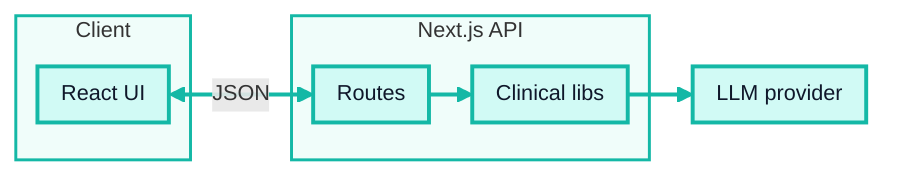
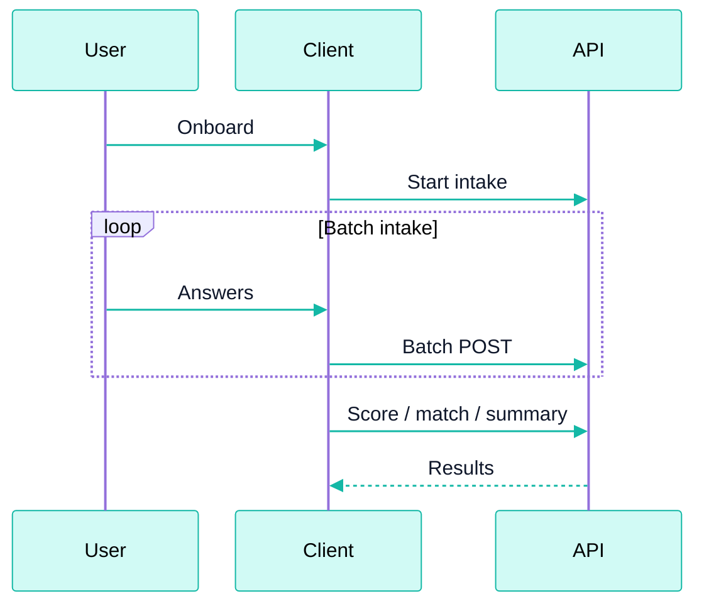
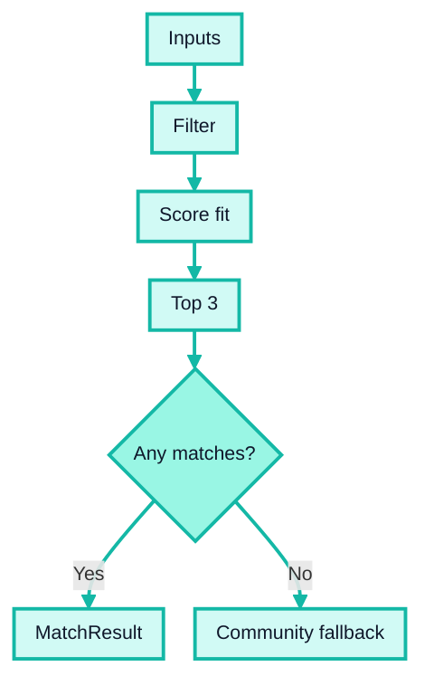
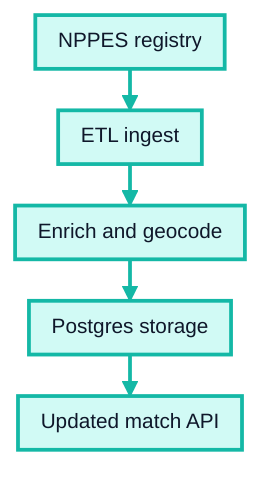
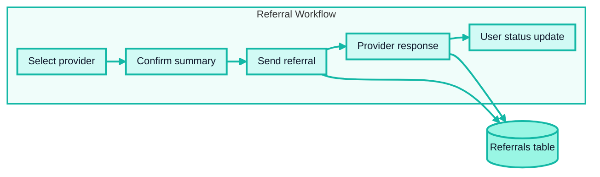
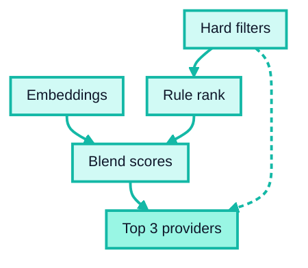

# ClearPath

**Prepared by:** Bilisuma Tadesse

## Software Requirements Specification (SRS)

### AI-Powered Mental Health Triage and Navigation — MVP1 Specification with MVP2+ Roadmap Annex

| **Field** | **Details** |
| --- | --- |
| **Document Type** | Software Requirements Specification (SRS) |
| **Project** | ClearPath — AI-Powered Mental Health Triage and Navigation |
| **Standard Reference** | IEEE 29148:2018 Systems and Software Engineering — Life Cycle Processes — Requirements Engineering |
| **Version** | v1.0 — Final Draft |
| **Date** | June 4, 2026 |
| **Live Prototype** | https://clearpathcare-demo.vercel.app |
| **Companion Documents** | Research Dossier; Product Dossier |

## Table of Contents

**Preamble**

- [P1. Scope](#p1-scope)
- [P2. Definitions and Abbreviations](#p2-definitions-and-abbreviations)
- [P3. Intended Audience](#p3-intended-audience)
- [P4. Assumptions and Constraints](#p4-assumptions-and-constraints)

**Part I — MVP1: Core Requirements**

1. [System Overview](#1-system-overview)
2. [Functional Requirements](#2-functional-requirements)
3. [Non-Functional Requirements](#3-non-functional-requirements)
4. [Data Requirements](#4-data-requirements)
5. [Interface Requirements](#5-interface-requirements)
6. [Safety and Security Requirements](#6-safety-and-security-requirements)
7. [Verification and Acceptance Criteria](#7-verification-and-acceptance-criteria)

**Part II — Architecture and Design Specification**

8. [Architectural Overview](#8-architectural-overview)
9. [Technology Stack](#9-technology-stack)
10. [System Boundaries and Trust Model](#10-system-boundaries-and-trust-model)
11. [Data Models](#11-data-models)
12. [API Specification](#12-api-specification)
13. [Core Workflow Specification](#13-core-workflow-specification)
14. [Pages and Routes](#14-pages-and-routes)
15. [Testing Specification](#15-testing-specification)
16. [Deployment Specification](#16-deployment-specification)
17. [Project Structure](#17-project-structure)

**Annex A — Future Roadmap: MVP2 and Beyond**

- [A1. Scope Boundary: MVP1 vs. Future](#a1-scope-boundary-mvp1-vs-future)
- [A2. MVP2: Validate and Harden](#a2-mvp2-validate-and-harden-days-830)
- [A3. MVP3: Close the Loop and Scale](#a3-mvp3-close-the-loop-and-scale-months-24)
- [A4. Advanced AI Capabilities](#a4-advanced-ai-capabilities)
- [A5. Enterprise Features](#a5-enterprise-features)
- [A6. Architecture Evolution](#a6-architecture-evolution)
- [A7. Extensibility Seams](#a7-extensibility-seams)

## Preamble

### P1. Scope

This document specifies the software requirements for ClearPath, an AI-powered mental health triage and care-navigation platform. Part I (Sections 1–7) contains the normative functional and non-functional requirements for the MVP1 release. Part II (Sections 8–17) documents the architecture and design decisions that realize those requirements. Annex A describes planned future capabilities and does not constitute normative requirements for the current release.

ClearPath is scoped as a pre-clinical navigation tool, not a clinical diagnostic system. It uses validated screening instruments (PHQ-9, GAD-7) to generate a clinical profile that supports provider matching. All clinical scoring is deterministic; no clinical scores are generated by a language model.

### P2. Definitions and Abbreviations

| Term | Definition |
| --- | --- |
| **PHQ-9** | Patient Health Questionnaire-9. A validated 9-item self-report instrument for screening and measuring depression severity. Scores range 0–27; bands: Minimal (0–4), Mild (5–9), Moderate (10–14), Moderately Severe (15–19), Severe (20–27). |
| **GAD-7** | Generalized Anxiety Disorder 7-item scale. A validated 7-item self-report instrument for screening and measuring anxiety severity. Scores range 0–21; bands: Minimal (0–4), Mild (5–9), Moderate (10–14), Severe (15–21). |
| **Item 9** | PHQ-9 item 9 ("Thoughts that you would be better off dead, or of hurting yourself in some way"). Endorsed at any level (value ≥ 1) triggers mandatory crisis detection. |
| **Care Level** | A stepped-care category derived deterministically from PHQ-9 and GAD-7 scores. Values: self_guided, coaching, therapy, psychiatry, urgent, crisis. |
| **Deterministic** | Processing that yields an identical output for a given input on every run, without language model involvement. Applied to all clinical scoring, severity banding, and care-level mapping. |
| **LLM** | Large Language Model. Used in ClearPath for three non-clinical functions: story-to-draft mapping, results summary narrative generation, and crisis-language classification on free text. |
| **Story Path** | An optional intake mode in which the user provides free-text narrative context. An LLM drafts suggested item values; the user must confirm each value before it is accepted for scoring. |
| **Questionnaire Path** | The primary intake mode. The user responds to PHQ-9 and GAD-7 items directly via a structured batched UI with 0–3 value selection. |
| **SafetySupportCard** | A UI component that surfaces crisis resources (988 Lifeline, Crisis Text Line, 911) inline when a crisis trigger is detected. Does not block intake completion. |
| **Batch** | A grouped set of PHQ-9 or GAD-7 items presented together in the questionnaire UI. The intake is structured as 7 batches across 16 items. |
| **Session** | A transient, server-side state object associating a session ID with intake answers, profile context, and processing results. No personally identifiable information is persisted to permanent storage in MVP1. |
| **PEPM** | Per-employee-per-month. The pricing unit for the B2B SaaS employer sales motion. |
| **HPSA** | Health Professional Shortage Area. A federal designation for geographic areas with insufficient mental health professional supply. |
| **SaMD** | Software as a Medical Device. ClearPath is not positioned as SaMD; it is intended for FDA General Wellness classification. |
| **WCAG** | Web Content Accessibility Guidelines. The target conformance level is WCAG 2.1 AA. |
| **PHI** | Protected Health Information as defined under HIPAA. MVP1 stores no PHI. |

### P3. Intended Audience

| Audience | Purpose |
| --- | --- |
| **Engineering team** | Functional and non-functional requirements; API contracts; data models; acceptance criteria |
| **Clinical reviewers** | Safety requirements (§6); scoring specifications (§13.3, §13.4); crisis detection logic (§13.4) |
| **Product and business stakeholders** | System overview (§1); requirements traceability to product decisions |
| **QA and testing** | Verification and acceptance criteria (§7); testing specification (§15) |
| **Regulatory reviewers** | Safety and compliance requirements (§6); scope definition (§1, §P1) |

### P4. Assumptions and Constraints

#### Assumptions

| ID | Assumption |
| --- | --- |
| A-01 | The user has access to a modern web browser and internet connectivity. |
| A-02 | The user has sufficient English-language literacy to complete PHQ-9 and GAD-7 items as presented. |
| A-03 | The user is not in acute crisis requiring immediate emergency intervention (the product addresses pre-crisis navigation, not emergency response). |
| A-04 | Provider data in the seeded dataset is accurate at the time of seeding; real-time availability is not guaranteed. |
| A-05 | The configured LLM provider is available and responsive for story path and summary generation. The questionnaire path functions without LLM availability. |
| A-06 | PHQ-9 and GAD-7 scoring band definitions remain as published in the validated instrument literature; threshold tables in §13.3 reflect the current validated definitions. |

#### Constraints

| ID | Constraint |
| --- | --- |
| C-01 | All clinical scoring (PHQ-9 total, GAD-7 total, severity banding, care-level determination) shall be implemented as deterministic logic with no LLM involvement. |
| C-02 | LLM-suggested item values in the story path shall not be accepted for scoring without explicit user confirmation. |
| C-03 | PHQ-9 item 9 crisis detection shall be deterministic and shall not depend on LLM availability. |
| C-04 | The /crisis page shall function independently of the main application; it shall have no dependency on shared application state or navigation. |
| C-05 | No personally identifiable information shall be written to permanent storage in MVP1. |
| C-06 | API keys and all server-side clinical logic shall be inaccessible to the client. |
| C-07 | The product shall make no diagnostic claims. All outputs shall be clearly labeled as screening results, not clinical diagnoses. |
| C-08 | Crisis detection shall not block the user from completing screening and receiving a care plan. |

# Part I — MVP1: Core Requirements

## 1. System Overview

### 1.1 Product Purpose

ClearPath is a web-based mental health triage and care-navigation application. Its purpose is to reduce the time between a user's decision to seek mental health support and a qualified, actionable provider shortlist — from the current national average of approximately 48 days to minutes.

ClearPath is not a therapy platform, a diagnostic system, or a crisis intervention service. It is a navigation tool: it collects validated screening data, derives a clinical profile deterministically, and surfaces matched providers.

### 1.2 System Context

The system operates between a motivated user (typically an employed adult with mild-to-moderate anxiety or depression) and the fragmented U.S. mental healthcare provider network. It interposes a structured triage layer that neither the user nor the provider ecosystem currently has access to.

ClearPath is deployed as a single web application. In MVP1, it relies on a seeded provider dataset. Future phases introduce real provider data, persistent sessions, and employer-facing features.

### 1.3 Key System Boundaries

ClearPath does not:

- Provide therapy or therapeutic interventions
- Make clinical diagnoses
- Replace crisis intervention services
- Verify real-time provider availability
- Access or store electronic health records
- Transmit protected health information in MVP1

## 2. Functional Requirements

### 2.1 User Onboarding and Profile Collection

| ID | Requirement |
| --- | --- |
| FR-001 | The system shall present a landing page that states the product's purpose, scope limitations (screening, not diagnosis), and a link to the /crisis page. |
| FR-002 | The system shall present a welcome page describing the four-step intake flow before the user begins onboarding. |
| FR-003 | The system shall collect a user profile consisting of: ZIP code, insurance type, primary concern, and (optionally) care format preference. |
| FR-004 | The profile wizard shall be completable in no more than three steps. |
| FR-005 | The system shall validate that ZIP code and insurance fields are populated before proceeding to intake. |
| FR-006 | The system shall accept an optional free-text context field during onboarding. If provided, the text shall be evaluated by the crisis classifier before intake begins. |

### 2.2 Intake: Questionnaire Path

| ID | Requirement |
| --- | --- |
| FR-010 | The system shall present PHQ-9 and GAD-7 items using verbatim instrument wording as published in the validated instruments. |
| FR-011 | The system shall group items into 7 batches: batches 0–2 covering PHQ-9 items 1–8 (mood chapter), batch 3 covering PHQ-9 item 9 alone (safety chapter), and batches 4–6 covering GAD-7 items 1–7 (anxiety chapter). |
| FR-012 | Each item shall accept a user-selected response value of 0, 1, 2, or 3. |
| FR-013 | The system shall display a progress indicator throughout the questionnaire showing current position relative to total items. |
| FR-014 | PHQ-9 item 9 (suicidal ideation item) shall be presented as a dedicated batch (batch 3) within its own chapter. |
| FR-015 | When PHQ-9 item 9 receives a confirmed response value of 1 or greater, the system shall display the SafetySupportCard before proceeding to the next batch. |
| FR-016 | The SafetySupportCard shall be informational and shall not prevent the user from completing the remaining intake items. |
| FR-017 | Upon completion of all 16 items, the system shall transition the user to the processing pipeline. |

### 2.3 Intake: Story Path

| ID | Requirement |
| --- | --- |
| FR-020 | The system shall offer an alternative story intake path in which the user may provide a free-text narrative of at least a minimum character threshold before proceeding. |
| FR-021 | On submission of the narrative, the system shall pass the text to the LLM story-inference service, which shall suggest a value of 0–3 for each of the 16 intake items. |
| FR-022 | Suggested item values shall be clearly labeled as AI-generated drafts in the review interface. |
| FR-023 | The user shall be able to review and modify each suggested value independently. |
| FR-024 | The system shall not accept story-path item values for scoring unless the user has explicitly confirmed each item on the review screen. |
| FR-025 | If the LLM returns a suggested value outside the range 0–3, the system shall clamp the value to the nearest valid boundary before displaying it. |
| FR-026 | The story path shall converge with the questionnaire path at the processing stage; scoring behavior shall be identical for equivalent confirmed answers. |

### 2.4 Scoring

| ID | Requirement |
| --- | --- |
| FR-030 | The system shall compute PHQ-9 total score as the sum of all 9 confirmed PHQ-9 item values. |
| FR-031 | The system shall compute GAD-7 total score as the sum of all 7 confirmed GAD-7 item values. |
| FR-032 | The system shall assign a PHQ-9 severity band according to the validated scoring thresholds: Minimal (0–4), Mild (5–9), Moderate (10–14), Moderately Severe (15–19), Severe (20–27). |
| FR-033 | The system shall assign a GAD-7 severity band according to the validated scoring thresholds: Minimal (0–4), Mild (5–9), Moderate (10–14), Severe (15–21). |
| FR-034 | Scoring shall be performed entirely by deterministic logic. No LLM shall be involved in score computation. |
| FR-035 | Item values with `confirmed = false` shall be excluded from all score computations. |

### 2.5 Care-Level Determination

| ID | Requirement |
| --- | --- |
| FR-040 | The system shall determine a care level for each completed intake using the following deterministic mapping: |
| FR-041 | If `isCrisis = true` (PHQ-9 item 9 ≥ 1 or LLM classifier confidence ≥ 0.85 on free text), care level shall be `crisis`. |
| FR-042 | If `isCrisis = false` and (PHQ-9 band = Severe OR GAD-7 band = Severe), care level shall be `urgent`. |
| FR-043 | If PHQ-9 band = Moderately Severe OR GAD-7 band = Moderate (without meeting crisis or urgent conditions), care level shall be `psychiatry`. |
| FR-044 | If PHQ-9 band = Moderate OR GAD-7 band = Moderate (without meeting higher-tier conditions), care level shall be `therapy`. |
| FR-045 | If PHQ-9 band = Mild OR GAD-7 band = Mild (without meeting higher-tier conditions), care level shall be `coaching`. |
| FR-046 | If PHQ-9 band = Minimal AND GAD-7 band = Minimal, care level shall be `self_guided`. |
| FR-047 | The `crisis` care level and the `urgent` care level shall be mutually exclusive and independently defined; a user with PHQ-9 item 9 ≥ 1 shall always receive `crisis`, not `urgent`. |

### 2.6 Crisis Detection

| ID | Requirement |
| --- | --- |
| FR-050 | The system shall implement two independent crisis detection layers: a deterministic layer (PHQ-9 item 9) and an LLM-based classifier layer (free text). |
| FR-051 | The deterministic layer shall evaluate the confirmed value of PHQ-9 item 9. If the value is 1 or greater, the system shall set `isCrisis = true` and `crisis source = "item9"`. |
| FR-052 | The deterministic crisis check shall not depend on LLM availability. It shall function on the questionnaire path regardless of LLM configuration. |
| FR-053 | The LLM classifier layer shall evaluate any free-text input (optional context, story narrative). If the classifier returns a confidence score of 0.85 or greater, the system shall set the classifier crisis flag and include it in the final `isCrisis` determination. |
| FR-054 | A `CrisisCheck` result shall include: crisis (boolean), confidence (float), and source ("item9", "classifier", or "none"). |
| FR-055 | When `isCrisis = true` at any point in the intake flow, the SafetySupportCard shall be displayed inline. |
| FR-056 | The SafetySupportCard shall display: 988 Suicide and Crisis Lifeline, Crisis Text Line, 911, and a link to the /crisis page. |
| FR-057 | Crisis detection shall not trigger mandatory redirection away from the intake flow. The user shall be able to complete screening and reach the results page. |
| FR-058 | When `isCrisis = true` at results, a safety banner shall be displayed prominently on the results page alongside the care plan and provider shortlist. |

### 2.7 Provider Matching

| ID | Requirement |
| --- | --- |
| FR-060 | The system shall filter the provider dataset to retain only providers whose insurance types include the user's stated insurance. |
| FR-061 | The system shall filter the remaining provider set to retain providers whose specialty aligns with the user's stated concern or care level. |
| FR-062 | The system shall apply care format filtering (in-person, telehealth, either) based on the user's stated format preference. |
| FR-063 | The system shall rank the filtered provider set by fit score and return the top 3 matches as the provider shortlist. |
| FR-064 | Each provider card in the results shall include: name, credentials, specialty, insurance accepted, format, estimated wait time, and at least one match reason. |
| FR-065 | If no providers satisfy all filter criteria, the system shall present a community resources fallback rather than an empty result. |
| FR-066 | Provider cards shall include a "verify before booking" notice and a last-updated timestamp to communicate data currency. |

### 2.8 Results and Summary

| ID | Requirement |
| --- | --- |
| FR-070 | The results page shall display a clinical profile card summarizing PHQ-9 score and band, GAD-7 score and band, and derived care level. |
| FR-071 | The clinical profile card shall include a clear non-diagnostic disclaimer stating that the results represent screening output, not a clinical diagnosis. |
| FR-072 | The system shall generate a plain-language, non-diagnostic summary narrative via LLM, personalized using the user's stated concern and care level. |
| FR-073 | The LLM prompt for summary generation shall instruct the model to: use non-clinical language, include a non-diagnostic framing statement, not suggest a specific diagnosis, and not recommend specific medications. |
| FR-074 | If LLM summary generation fails or times out, the system shall display a deterministic fallback summary; the user shall reach the results page regardless of LLM availability. |
| FR-075 | The results page shall display a processing pipeline visualization showing score, match, and summary steps. |
| FR-076 | The results page shall include a print/save option that renders the care packet including clinical profile, care level, and provider shortlist. |

### 2.9 Crisis Page

| ID | Requirement |
| --- | --- |
| FR-080 | The /crisis page shall load independently of the main application. It shall have no dependency on shared application state, session data, or navigation. |
| FR-081 | The /crisis page shall display: 988 Suicide and Crisis Lifeline, Crisis Text Line, 911. |
| FR-082 | The /crisis page shall function even if the main application fails to load. |
| FR-083 | The /crisis page shall be accessible from the landing page, results page, and SafetySupportCard at all times. |

### 2.10 Session Management

| ID | Requirement |
| --- | --- |
| FR-090 | The system shall maintain session state using a session ID generated at intake start. |
| FR-091 | Session state shall be stored in the browser (sessionStorage) on the client and in an in-memory store on the server. |
| FR-092 | If a user returns to the intake start with an existing session ID, the system shall resume from the current batch state rather than resetting. |
| FR-093 | Session data shall not persist beyond the browser session (client) or server cold start (server-side in-memory store). |

## 3. Non-Functional Requirements

### 3.1 Performance

| ID | Requirement |
| --- | --- |
| NFR-001 | The end-to-end intake flow (from profile completion to results page render) shall complete within a median of 7 minutes under normal usage conditions. |
| NFR-002 | API routes for scoring and matching shall respond within 2 seconds under normal load for the MVP1 seeded dataset. |
| NFR-003 | The /crisis page shall load and render static content within 3 seconds on a standard mobile connection. |

### 3.2 Availability

| ID | Requirement |
| --- | --- |
| NFR-010 | The questionnaire path and deterministic scoring shall function without LLM availability. LLM-dependent features (story path, results summary) shall degrade gracefully when the LLM provider is unavailable. |
| NFR-011 | The /crisis page shall be accessible independently of the main application's availability. |

### 3.3 Accessibility

| ID | Requirement |
| --- | --- |
| NFR-020 | The intake form and results page shall conform to WCAG 2.1 Level AA. |
| NFR-021 | All form elements shall have associated labels. |
| NFR-022 | The application shall be navigable by keyboard. |
| NFR-023 | Color is not used as the sole means of conveying information. |

### 3.4 Responsiveness

| ID | Requirement |
| --- | --- |
| NFR-030 | All pages shall render correctly at a minimum viewport width of 375px (mobile). |
| NFR-031 | The intake questionnaire shall be fully operable on a mobile touch interface. |

### 3.5 Security

| ID | Requirement |
| --- | --- |
| NFR-040 | LLM API keys shall be accessible only in server-side execution contexts. They shall never be exposed to the client. |
| NFR-041 | All clinical scoring logic shall execute server-side. The client shall not receive scoring algorithms. |
| NFR-042 | The system shall not log or persist user-provided free text to permanent storage in MVP1. |

### 3.6 Maintainability

| ID | Requirement |
| --- | --- |
| NFR-050 | The codebase shall have no TypeScript compilation errors at build time. |
| NFR-051 | ESLint shall pass without warnings on core application files. |
| NFR-052 | Scoring thresholds shall be defined in a single authoritative location; no threshold values shall be hardcoded in multiple places. |

## 4. Data Requirements

### 4.1 User Profile

The user profile captures onboarding context for session threading and match filtering. It shall contain:

- ZIP code (string, required)
- Insurance type (string, required; must correspond to a valid option in the provider dataset)
- Primary concern (one of: anxiety, depression, relationship, stress, unsure)
- Care format preference (optional; one of: telehealth, in-person, either)
- Optional context text (optional free-text string; used for crisis classification and summary personalization only)

### 4.2 Intake Answer

Each intake answer shall record:

- Instrument identifier (PHQ9 or GAD7)
- Item index within the instrument (0-based)
- Response value (integer in {0, 1, 2, 3})
- Confirmation flag (boolean; items with `confirmed = false` are excluded from scoring)
- Optional raw text (for story-path provenance tracking only)

### 4.3 Score Result

The score result shall contain:

- PHQ-9 total (integer, 0–27)
- PHQ-9 severity band (one of: minimal, mild, moderate, moderately_severe, severe)
- PHQ-9 item 9 value (integer in {0, 1, 2, 3})
- GAD-7 total (integer, 0–21)
- GAD-7 severity band (one of: minimal, mild, moderate, severe)
- Care level (one of: self_guided, coaching, therapy, psychiatry, urgent, crisis)
- isCrisis (boolean)
- isUrgent (boolean; mutually exclusive with isCrisis)

### 4.4 Provider Record

Each provider record in the dataset shall contain:

- Unique identifier
- Name and credentials
- Specialty list (one or more)
- Accepted insurance types (one or more)
- Care format (telehealth, in-person, or either)
- ZIP code
- Estimated wait days
- Cost per session (integer or null if not available)

### 4.5 Match Result

The match result shall contain:

- A list of up to 3 matched provider cards, each containing the provider record, a computed fit score, and a list of match reasons
- An optional fallback list of community resources, populated when no providers satisfy filter criteria

## 5. Interface Requirements

### 5.1 User Interface

| ID | Requirement |
| --- | --- |
| UI-001 | The interface shall use plain, non-clinical language throughout the intake and results flow. |
| UI-002 | PHQ-9 and GAD-7 items shall display the verbatim instrument text without modification. |
| UI-003 | Non-diagnostic disclaimers shall appear at the following locations: landing page, welcome page, intake choice page, results page (adjacent to clinical profile card), and within the LLM results summary. |
| UI-004 | LLM-generated content on the story review page shall be visually differentiated from user-confirmed values. |
| UI-005 | The care level recommendation shall be presented as a care category name and description; it shall not use clinical diagnostic language. |

### 5.2 External Service Interfaces

| Service | Interface Type | MVP1 Usage |
| --- | --- | --- |
| LLM provider (Hugging Face / OpenAI / OpenRouter) | HTTP REST API via server-side abstraction | Story mapping, results summary, crisis text classification |
| Vercel hosting | Deployment platform | Serverless deployment of Next.js application |

No real-time provider availability APIs, insurance eligibility APIs, or EHR interfaces are in scope for MVP1.

## 6. Safety and Security Requirements

### 6.1 Clinical Safety Requirements

| ID | Requirement |
| --- | --- |
| SS-001 | The system shall never generate PHQ-9 or GAD-7 total scores using a language model. Scores shall be derived exclusively from deterministic computation on confirmed user responses. |
| SS-002 | PHQ-9 item 9 crisis detection shall be deterministic and shall evaluate the confirmed user response directly. It shall not depend on LLM inference. |
| SS-003 | The LLM crisis classifier shall supplement, not replace, the deterministic item 9 check. |
| SS-004 | Care-level `crisis` shall be assigned if and only if `isCrisis = true`. `isCrisis = true` is set by item 9 ≥ 1 (deterministic) or LLM classifier confidence ≥ 0.85. |
| SS-005 | The care levels `crisis` and `urgent` shall be independently and non-overlappingly defined. |
| SS-006 | Story-path intake shall not permit unconfirmed AI-suggested item values to enter the scoring computation. |
| SS-007 | Crisis detection shall never result in mandatory redirection away from the intake flow. |
| SS-008 | A user whose intake results in `isCrisis = true` shall receive a provider shortlist and care plan alongside crisis resources. |

### 6.2 Prompt Security Requirements

| ID | Requirement |
| --- | --- |
| SS-010 | All LLM calls shall use a hardened system prompt that prohibits the model from: providing therapy, clinical advice, or diagnoses; generating PHQ-9 or GAD-7 numeric scores; recommending specific medications; providing specific provider recommendations. |
| SS-011 | The system prompt shall constrain the LLM to the specific task assigned (story-item mapping, summary generation, or crisis classification). |
| SS-012 | The system shall be tested with adversarial inputs designed to elicit clinical advice, diagnostic statements, or score generation from the LLM. No such outputs shall pass the system prompt constraint in testing. |

### 6.3 Data Privacy Requirements

| ID | Requirement |
| --- | --- |
| SS-020 | MVP1 shall store no personally identifiable information in any persistent storage. |
| SS-021 | Session data shall be ephemeral: stored in browser sessionStorage (client-side) and server in-memory state (server-side). |
| SS-022 | Text provided to the LLM provider shall be limited to the minimum required for the specific API call. |
| SS-023 | LLM API credentials shall reside in server-side environment variables only. |
| SS-024 | No user data shall be shared with third parties other than the configured LLM provider for the specific API call. |

### 6.4 Disclaimer Requirements

| ID | Requirement |
| --- | --- |
| SS-030 | The system shall display a non-diagnostic disclaimer at the landing page before the user enters the flow. |
| SS-031 | The system shall display a non-diagnostic disclaimer at the welcome page. |
| SS-032 | The system shall display a non-diagnostic disclaimer at the intake choice page before screening begins. |
| SS-033 | The results page shall display a non-diagnostic disclaimer adjacent to the clinical profile card. |
| SS-034 | The LLM summary prompt shall instruct the model to include a non-diagnostic framing statement in the generated narrative. |

## 7. Verification and Acceptance Criteria

### 7.1 Functional Acceptance Criteria

| ID | Criterion | Pass Condition |
| --- | --- | --- |
| AC-001 | PHQ-9 scoring accuracy | System PHQ-9 total shall match manual scoring for a minimum of 10 test cases spanning all band boundaries. |
| AC-002 | GAD-7 scoring accuracy | System GAD-7 total shall match manual scoring for a minimum of 10 test cases spanning all band boundaries. |
| AC-003 | Item 9 crisis detection | PHQ-9 item 9 value ≥ 1 shall result in isCrisis = true and care level = crisis in 100% of test runs. |
| AC-004 | Crisis UX continuity | User shall be able to complete intake and reach the results page when item 9 ≥ 1; SafetySupportCard and results safety banner shall both be present. |
| AC-005 | Story path scoring integrity | An intake completed via story path with confirmed answers equivalent to a questionnaire-path intake shall produce identical PHQ-9 and GAD-7 totals. |
| AC-006 | Unconfirmed answer exclusion | A story-path intake in which item values are not confirmed on the review screen shall not result in those values contributing to the score. |
| AC-007 | LLM score exclusion | LLM shall not produce or modify any PHQ-9 or GAD-7 total score in a minimum of 20 test runs across all intake paths. |
| AC-008 | Intake completion time | Median completion time from profile start to results page shall be ≤ 7 minutes across a minimum of 5 test runs. |
| AC-009 | Match relevance | Matched providers shall include only providers whose accepted insurance includes the user's stated insurance type and whose specialty is relevant to the stated concern. |
| AC-010 | Community fallback | When no providers match the filter criteria, the community resources fallback shall be displayed. |
| AC-011 | Crisis page independence | /crisis page shall load and display 988, Crisis Text Line, and 911 resources without requiring main application state. |

### 7.2 Non-Functional Acceptance Criteria

| ID | Criterion | Pass Condition |
| --- | --- | --- |
| AC-020 | Mobile responsiveness | All pages render correctly and all intake controls are operable at 375px viewport width. |
| AC-021 | Accessibility | WCAG 2.1 AA audit of intake and results pages passes. |
| AC-022 | Build integrity | TypeScript compilation produces no errors. |
| AC-023 | Lint | ESLint passes with no warnings on core application files. |

### 7.3 Safety Verification Checklist

| ID | Check | Pass Condition |
| --- | --- | --- |
| SV-001 | Item 9 presented in dedicated safety chapter | Batch 3 contains only PHQ-9 item 9; chapter label is "safety". |
| SV-002 | Item 9 trigger → SafetySupportCard | Item 9 response ≥ 1 causes SafetySupportCard to display before next batch; screening continues. |
| SV-003 | Crisis intake → results with safety banner | Completing intake after item 9 trigger reaches results page with crisis care level and safety banner. |
| SV-004 | /crisis page loads | /crisis displays 988, Crisis Text Line, 911 on direct navigation. |
| SV-005 | High-risk story → no hard block | Story text containing crisis-adjacent language does not prevent intake completion; SafetySupportCard displays. |
| SV-006 | Benign story → no false crisis flag | A benign story narrative does not trigger the crisis classifier. |
| SV-007 | Adversarial prompt → no clinical advice | LLM does not return therapy, diagnostic, or score-generation content under adversarial prompt inputs. |

# Part II — Architecture and Design Specification

## 8. Architectural Overview

### 8.1 Summary

MVP1 is a single Next.js (App Router) full-stack application deployed on Vercel. The UI and all API routes are contained within a single deployable unit. A language model is used for three specific functions: optional story-to-draft screening item mapping, plain-language results summary generation, and crisis-language classification on free text.

All clinical logic — scoring, severity classification, care-level determination, provider ranking, and PHQ-9 item 9 crisis detection — is implemented as deterministic server-side logic with no language model involvement.

**Architectural decisions deferred beyond MVP1:**

| Approach | Status | Rationale |
| --- | --- | --- |
| FastAPI separate service | MVP3 | AI orchestration complexity does not justify a second service in MVP1 |
| LangGraph workflow orchestration | MVP3+ | Linear batch intake does not require a graph workflow in MVP1 |
| Conversational LLM intake | Excluded | Higher latency, hallucination risk, and test surface; batched UI is more reliable |
| Postgres / database server | MVP2 | Seeded JSON proves the match loop; persistent storage planned for MVP2 |
| Auth / accounts | MVP2 | Anonymous sessions reduce friction and privacy exposure in MVP1 |

### 8.2 Component Diagram



### 8.3 Request Lifecycle: Happy Paths

**Standard Questionnaire Path**



**Optional Story Path**


**Crisis Resource Navigation**


## 9. Technology Stack

| Layer | Technology | Version / Notes |
| --- | --- | --- |
| **Framework** | Next.js (App Router) | v16; TypeScript throughout |
| **Styling** | Tailwind CSS | v4; theme tokens in `app/globals.css` |
| **AI Inference** | HF / OpenAI / OpenRouter | Via `lib/ai/openai.ts`; configured by `LLM_*` env vars |
| **Crisis Classification** | Rules + LLM | `lib/screening/crisis.ts`; LLM threshold ≥ 0.85 confidence |
| **Clinical Logic** | Pure TypeScript | `lib/screening/`, `lib/matching/`; zero LLM involvement |
| **Provider Data** | `data/providers.json` | Seeded 20+ providers; 3 specialties, 4 insurance types, 3 ZIP clusters |
| **Client Persistence** | `sessionStorage` | `lib/storage/client-storage.ts`; session ID, profile, results snapshot |
| **Server Persistence** | In-memory map | `lib/storage/session.ts`; ephemeral across Vercel cold starts (MVP1 limitation) |
| **Testing** | Vitest | 50 tests across scoring, matching, intake flow, care-level, story inference, LLM provider |
| **Deployment** | Vercel | https://clearpathcare-demo.vercel.app |

**Environment configuration:**

| Variable | Description |
| --- | --- |
| `LLM_PROVIDER` | Provider identifier (e.g., `huggingface`) |
| `LLM_API_KEY` | API token |
| `LLM_BASE_URL` | Provider base URL |
| `LLM_MODEL` | Model identifier |

Provider-specific aliases (`HF_*`, `OPENAI_API_KEY`, `OPENROUTER_*`) are supported. The questionnaire-only path operates without LLM configuration. The story path and results summary require a configured LLM.

## 10. System Boundaries and Trust Model

### 10.1 Inside MVP1 Scope

| Component | Notes |
| --- | --- |
| Next.js app (UI + API routes) | Single deployable on Vercel |
| Deterministic scoring, matching, and routing | Pure TypeScript; no external dependencies |
| Seeded `data/providers.json` | ~20 providers for demonstration |
| Dual-layer crisis detection | Deterministic item-9 + LLM classifier |
| Static `/crisis` page | Loads independently; no app dependencies |
| Browser sessionStorage + server in-memory session | Ephemeral; no PHI persistence |

### 10.2 Outside MVP1 Scope (Deferred)

| Component | Target Phase |
| --- | --- |
| OpenAI / HF API (external LLM) | Always external |
| NPPES / live provider availability | MVP2 |
| Insurance eligibility APIs / clearinghouses | MVP3 |
| Accounts, auth, HIPAA datastore | MVP2+ |
| EHR / booking integration | Long-term |
| FastAPI AI service | MVP3 |
| LangGraph workflow | MVP3+ (only if justified) |

### 10.3 Trust Boundary

API keys and all clinical scoring logic reside server-side only. The client never:

- Computes PHQ-9 or GAD-7 scores
- Applies severity band logic
- Calls the LLM provider directly
- Handles API credentials

All scoring, matching, and AI calls are server-side API routes. The client submits answers and receives structured results.

## 11. Data Models

These are TypeScript transport data transfer objects (DTOs). No long-term PHI storage exists in MVP1.

### 11.1 Patient Profile (Onboarding Context)

The profile captures user ZIP, insurance, concern, format preference, and optional free-text context. `optionalContext` is used for summary personalization and crisis classification; it is not used for silent scoring of intake items.

### 11.2 Intake Answer

Each intake answer records instrument identifier (PHQ9 or GAD7), item index (0-based), response value (0–3), confirmation status (boolean), and optional raw text for story-path provenance.

### 11.3 Score Result

The score result records PHQ-9 total, PHQ-9 severity band, PHQ-9 item 9 value, GAD-7 total, GAD-7 severity band, derived care level, isCrisis (boolean), and isUrgent (boolean).

**Scoring thresholds (deterministic):**

| Instrument | Band | Score Range |
| --- | --- | --- |
| PHQ-9 | Minimal | 0–4 |
| PHQ-9 | Mild | 5–9 |
| PHQ-9 | Moderate | 10–14 |
| PHQ-9 | Moderately Severe | 15–19 |
| PHQ-9 | Severe | 20–27 |
| GAD-7 | Minimal | 0–4 |
| GAD-7 | Mild | 5–9 |
| GAD-7 | Moderate | 10–14 |
| GAD-7 | Severe | 15–21 |

**Care-level mapping (deterministic):**

| Condition | Care Level |
| --- | --- |
| isCrisis = true (item 9 ≥ 1 or classifier confidence ≥ 0.85) | crisis |
| PHQ-9 Severe or GAD-7 Severe, and isCrisis = false | urgent |
| PHQ-9 Moderately Severe or GAD-7 Moderate (below urgent/crisis threshold) | psychiatry |
| PHQ-9 Moderate or GAD-7 Moderate (below psychiatry threshold) | therapy |
| PHQ-9 Mild or GAD-7 Mild | coaching |
| PHQ-9 Minimal and GAD-7 Minimal | self_guided |

### 11.4 Intake Batch State (API Response)

The batch state response includes: batch index, total batch count, chapter identifier and intro content, item list with global index and safety flag, progress counters, done flag, and a CrisisCheck result.

### 11.5 Crisis Check

The crisis check response includes: crisis (boolean), confidence (float 0–1), and source ("item9", "classifier", or "none").

### 11.6 Provider Record

Each provider record includes: unique ID, name, credentials, specialty list, accepted insurance list, care format, ZIP code, estimated wait days, cost per session (nullable), and avatar seed.

### 11.7 Match Result

The match result includes a list of matched provider cards (each with provider record, fit score, and match reasons) and an optional community resources fallback list.

## 12. API Specification

All routes accept `POST` requests with JSON request/response bodies. The `sessionId` field in the request body threads server-side session state.

### 12.1 Route Reference

| Route | Purpose | Key Inputs | Key Outputs |
| --- | --- | --- | --- |
| `POST /api/intake/start` | Begin or resume batch intake; crisis-check optionalContext | `{ sessionId, onboarding, mode }` | IntakeBatchState |
| `POST /api/intake/batch` | Submit one batch of answers; return next batch state | `{ sessionId, answers[] }` | IntakeBatchState |
| `POST /api/intake/infer-story` | Classify story for crisis; LLM drafts 0–3 per item | `{ sessionId, story }` | `{ suggestions[], crisis }` |
| `POST /api/intake/review-submit` | Persist all 16 confirmed review answers | `{ sessionId, answers[] }` | `{ crisis, done }` |
| `POST /api/intake/session` | Return current session answers, story, and AI suggestions | `{ sessionId }` | `{ answers[], story, aiSuggestions[] }` |
| `POST /api/intake/score` | Compute deterministic ScoreResult | `{ sessionId }` | ScoreResult |
| `POST /api/match` | Compute deterministic MatchResult | `{ sessionId, scoreResult }` | MatchResult |
| `POST /api/summary` | Generate LLM non-diagnostic narrative with deterministic fallback | `{ sessionId, scoreResult, matchResult }` | `{ summary: string }` |

**Out of scope for MVP1:** Legacy conversational intake routes are not implemented. Crisis classification is handled within `POST /api/intake/infer-story` and `POST /api/intake/start`.

### 12.2 Crisis Behavior at the API Layer

| Trigger | API Behavior | UI Behavior |
| --- | --- | --- |
| PHQ-9 item 9 ≥ 1 | Batch response includes `crisis: { crisis: true, source: "item9" }` | SafetySupportCard shown; screening continues |
| Story classifier ≥ 0.85 | `infer-story` sets classifier crisis flag on session | Flagged; affects final isCrisis at score time |
| Profile context classifier | `start` may set initial crisis flag | Logged; does not block flow or redirect |
| Final `isCrisis` at results | `score` sets `isCrisis = true` | Safety banner on /results; /crisis link offered |

### 12.3 Error Handling

All API routes shall return structured responses with a `success` flag. On failure, the response shall include an `error` string and optional error code. Client-side: summary failures shall invoke deterministic fallback text; the user shall reach the results page regardless.

## 13. Core Workflow Specification

### 13.1 Batch Intake Engine

The intake is structured as 7 batches across 16 items (PHQ-9 items 0–8, GAD-7 items 9–15):

| Batch | Items (global indices) | Chapter | Notes |
| --- | --- | --- | --- |
| 0 | 0, 1, 2 | mood | PHQ-9 items 1–3 |
| 1 | 3, 4, 5 | mood | PHQ-9 items 4–6 |
| 2 | 6, 7 | mood | PHQ-9 items 7–8 |
| 3 | 8 | safety | PHQ-9 item 9 — alone; triggers SafetySupportCard if value ≥ 1 |
| 4 | 9, 10, 11 | anxiety | GAD-7 items 1–3 |
| 5 | 12, 13, 14 | anxiety | GAD-7 items 4–6 |
| 6 | 15 | anxiety | GAD-7 item 7 |

**Session flow:**


**Session resume:** If a client boots with an existing session ID, the start endpoint shall return the current batch state rather than resetting the session.

### 13.2 Story Review Path


**LLM story inference constraints:**

- The LLM shall suggest a value of 0–3 per item; it shall not interpret clinical severity
- Suggestions shall be clearly labeled as drafts in the review UI
- The user may override any suggestion to any value 0–3
- Out-of-range LLM values shall be clamped to the nearest valid boundary before display

### 13.3 Scoring Engine Behavior

The scoring engine shall:

- Accept a complete set of confirmed intake answers
- Sum confirmed PHQ-9 answers to produce the PHQ-9 total
- Extract the confirmed value of PHQ-9 item 9 separately
- Sum confirmed GAD-7 answers to produce the GAD-7 total
- Derive severity bands from the totals using the thresholds in §11.3
- Derive care level from bands, item 9 value, and classifier crisis flag using the mapping in §11.3
- Set `isCrisis = true` if PHQ-9 item 9 ≥ 1 or classifier crisis flag is set
- Set `isUrgent = true` if isCrisis is false and PHQ-9 band is Severe or GAD-7 band is Severe

### 13.4 Crisis Detection Behavior

**Layer 1 — Deterministic (always active):** The system shall evaluate the confirmed value of PHQ-9 item 9 directly. If the value is 1 or greater, it shall return `{ crisis: true, confidence: 1.0, source: "item9" }`. This check shall not invoke the LLM under any circumstances.

**Layer 2 — LLM classifier (on free text only):** For story and optional context text, the system shall invoke the LLM crisis classifier with a dedicated system prompt. If the LLM returns a confidence score of 0.85 or greater, it shall return `{ crisis: true, confidence: <score>, source: "classifier" }`. This layer supplements but does not replace the deterministic layer.

**Layer 3 — UX (always visible when triggered):** The SafetySupportCard component shall display 988 Suicide and Crisis Lifeline, Crisis Text Line, and 911. It shall be non-blocking. The safety card shall also appear as a banner on the results page for any intake with `isCrisis = true`.

### 13.5 Provider Matching Behavior



The matching engine shall apply hard filters (insurance, specialty, format) before computing fit scores. It shall return the top 3 providers by fit score. If no providers pass all filters, it shall return the community resources fallback.

### 13.6 Client Finalization Pipeline

The processing page shall orchestrate the following sequential steps and display step-by-step progress to the user:


If the summary step fails, the pipeline shall substitute a deterministic fallback summary and complete normally.

## 14. Pages and Routes

| Route | Component | Role | Notes |
| --- | --- | --- | --- |
| `/` | Landing | Marketing landing | Value prop, screening disclaimer, crisis link |
| `/welcome` | Welcome | Journey preview | Entry point to onboarding; describes the 4-step flow |
| `/onboarding` | Profile wizard | Multi-step profile | ZIP, insurance, concern, format; 3-step wizard |
| `/intake` | Intake choice | Path selection | User selects questionnaire path or story path |
| `/intake/questions` | Batched questionnaire | PHQ-9/GAD-7 UI | BatchQuestionnaire component; progress indicator; chapter intros |
| `/intake/story` | Narrative entry | Free-text intake | Character minimum; submit triggers story inference |
| `/intake/review` | AI draft review | Story review | 16 items with AI suggestions; user confirms each |
| `/processing` | Processing pipeline | Pipeline progress | Score → match → summary steps |
| `/results` | Results display | Output page | ClinicalProfileCard, ProviderCard ×3, HowResultsWork, safety banner |
| `/crisis` | Crisis resources | Static crisis page | Dark theme; 988, Crisis Text Line, 911; no app dependencies |

**Route protection:** No authentication in MVP1. All routes are public. Session state is managed via sessionStorage (client) and an in-memory map (server).

**Crisis page independence:** `/crisis` uses a dedicated layout with no shared dependencies. It is a static page that functions if the main application fails.

## 15. Testing Specification

### 15.1 Automated Test Requirements

The system shall have automated test coverage for the following domains:

| Domain | Required Coverage |
| --- | --- |
| PHQ-9 scoring | All band boundary values (0, 4, 5, 9, 10, 14, 15, 19, 20, 27) and item 9 crisis flag |
| GAD-7 scoring | All band boundary values (0, 4, 5, 9, 10, 14, 15, 21) |
| Care-level mapping | All input combinations across band and crisis flag values; urgent vs. crisis distinction; edge cases |
| Provider matching | Insurance filter, specialty filter, format filter, ranking logic, community fallback trigger |
| Intake flow | Batch progression, item 9 crisis detection, session resume, review-submit flow |
| Story inference | LLM draft normalization, out-of-range value clamping, missing item handling |
| LLM provider | Provider initialization, fallback behavior, error handling |

The current test suite comprises 50 automated tests executed by Vitest. All tests shall pass as a prerequisite for production deployment.

### 15.2 Manual End-to-End Verification

The following personas shall be verified against the production deployment before each release:

| Persona | Path | Key Verification |
| --- | --- | --- |
| Mild anxiety | Questionnaire | Low severity bands; coaching or self-guided care level; provider match includes relevant specialty |
| Moderate depression | Questionnaire | Therapy-level care; item 9 = 0; no crisis banner |
| Crisis (item 9 ≥ 1) | Questionnaire | Crisis care level; safety banner on results; providers still shown; /crisis accessible |
| Story path | Story + review | AI draft displayed; scores computed only after confirmation; equivalent confirmed answers produce identical scores as questionnaire path |

### 15.3 Safety Verification Requirements

All six safety verification checks in §7.3 shall be executed and documented before release.

### 15.4 Non-Functional Verification Requirements

| Test | Condition |
| --- | --- |
| Responsive design | Renders correctly at 375px viewport |
| Accessibility | WCAG 2.1 AA audit passes on intake + results pages |
| Build integrity | Compilation produces no TypeScript errors |
| Lint | ESLint passes with no warnings on core files |

## 16. Deployment Specification

### 16.1 Production Environment

| Parameter | Value |
| --- | --- |
| **Host** | Vercel (hobby tier; instant deploys from GitHub main) |
| **URL** | https://clearpathcare-demo.vercel.app |
| **Environment variables** | Set in Vercel dashboard: `LLM_PROVIDER`, `LLM_API_KEY`, `LLM_BASE_URL`, `LLM_MODEL` |

### 16.2 Post-Deploy Verification

The following checks shall be performed after every production deployment:

1. Confirm `/`, `/welcome`, and `/crisis` load successfully.
2. Run the questionnaire-path persona end-to-end on production.
3. Confirm LLM-dependent paths (story intake or results summary) respond as expected.

### 16.3 Known Limitations (MVP1)

1. **Session persistence:** In-memory sessions do not survive Vercel cold starts. Addressed in MVP2 with a persistent session store.
2. **Rate limiting:** API routes are not rate-limited in MVP1. Production hardening should include Vercel rate limiting or middleware if traffic increases.
3. **LLM availability:** If the configured LLM provider is unavailable, story mapping may fail; results summary uses a deterministic fallback; scoring and matching are unaffected on the questionnaire path.

## 17. Project Structure

```
app/
  page.tsx
  welcome/page.tsx
  onboarding/page.tsx
  intake/
    page.tsx
    questions/page.tsx
    story/page.tsx
    review/page.tsx
  processing/page.tsx
  results/page.tsx
  crisis/
    page.tsx
    layout.tsx
  api/
    intake/
      start/route.ts
      batch/route.ts
      infer-story/route.ts
      review-submit/route.ts
      session/route.ts
      score/route.ts
    match/route.ts
    summary/route.ts

lib/
  ai/
    openai.ts
    prompts.ts
    story-inference.ts
  intake/
    intake-flow.ts
    instruments.ts
    finalize-intake-client.ts
  screening/
    scoring.ts
    crisis.ts
    screening-summary.ts
  storage/
    session.ts
    client-storage.ts
  matching/
    matcher.ts
    provider-avatar.ts
  hooks/
    use-session-ready.ts
  types.ts
  validators.ts
  utils.ts

components/
  shared/
    safety-support-card.tsx
  intake/
    batch-questionnaire.tsx
    chapter-intro.tsx
    processing-screen.tsx
  results/
    clinical-profile-card.tsx
    provider-card.tsx
    how-results-work.tsx

data/
  providers.json

tests/
  scoring.test.ts
  care-level.test.ts
  matcher.test.ts
  intake-flow.test.ts
  story-inference.test.ts
  llm-provider.test.ts

.env.example
README.md
```

# Annex A — Future Roadmap: MVP2 and Beyond

> **Annex scope statement.** This annex describes planned future capabilities for ClearPath MVP2 and beyond. Content in this annex represents intended future scope and does not constitute normative requirements for the MVP1 release. Architecture decisions, feature specifications, and infrastructure changes described here are subject to revision based on MVP1 validation results and product learnings.

## A1. Scope Boundary: MVP1 vs. Future

| Capability | MVP1 | MVP2 (Days 8–30) | MVP3+ (Months 2–6) |
| --- | --- | --- | --- |
| Structured PHQ-9/GAD-7 (batched UI, verbatim) | Complete | Refine UX | Adaptive multi-instrument |
| Optional story → AI draft → user review | Complete | Clinical review of mapping | Richer narrative intake |
| Deterministic scoring + care level | Complete | Unchanged | Unchanged |
| Dual-layer crisis detection + safety card + /crisis | Complete | Hardened classifier + audit log | Continuous monitoring |
| Provider match | Complete (seeded) | Real data | Embeddings-based semantic match |
| Results + summary + processing pipeline | Complete | + Trends | + Shareable clinician handoff |
| Server session persistence | In-memory only | Postgres/session store | Full persistence |
| Provider availability (real-time) | Out of scope | Freshness signal | Near-real-time |
| Accounts / longitudinal tracking | Out of scope | Opt-in | Full |
| Employer dashboard | Out of scope | v0 (aggregate) | Analytics + ROI |
| Provider notifications / referrals | Out of scope | v1 | Booking handoff |
| Insurance verification | Out of scope | Stub | Live eligibility |
| FastAPI AI service | Out of scope | Introduced | Core |
| LangGraph orchestration | Out of scope | Evaluate | Adopted where justified |
| HIPAA-compliant architecture | Out of scope (no PHI) | Designed | Enforced for pilots |
| Multi-language | Out of scope | Spanish | Top-N languages |

## A2. MVP2: Validate and Harden (Days 8–30)

### A2.1 Goal

Turn the prototype into a pilot-ready product with real provider data, real users, and the foundation for the first employer contract.

### A2.2 Real Provider Data Pipeline

Replace seeded `providers.json` with a dataset of real, contactable providers.



Target: ~500 real providers across 5 metros (Boston, New York, Chicago, Los Angeles, Houston).

**Success metric:** At least 90% of result cards resolve to a real, contactable provider with a functioning phone number or online booking link.

### A2.3 Session Persistence

Deploy managed Postgres with a `sessions` table. Migrate session storage from in-memory map to database-backed adapter; session TTL of 72 hours. Opt-in longitudinal tracking via magic-link authentication with a `completed_intakes` table and a `/history` re-screen view.

### A2.4 Clinical Advisory Validation

Engage 2–3 licensed clinicians to review:

- PHQ-9 and GAD-7 item presentation and pacing
- Care-level mapping logic (urgent vs. therapy vs. coaching appropriateness)
- Story-to-draft mapping quality
- Crisis detection sensitivity and false positive rate

Validation results shall be documented in the README as a transparency artifact.

### A2.5 Employer Dashboard v0

Aggregate-only employer dashboard supporting the first pilot conversation:

- `employer_accounts` table; domain-based employee access; no individual-level data without consent
- Metrics: completion rate, care-level distribution, time-to-first-match, weekly trends, crisis rate (percentage only)
- Route: `/employer/dashboard`; employer admin auth via magic link or SSO stub

**HIPAA note:** Aggregate-only data does not constitute PHI. HIPAA-aware architecture review should begin at this phase in anticipation of identified-data pilots.

### A2.6 First Employer Pilot Configuration

Target: 1 signed mid-market employer (at least 200 employees).

**Pilot setup:** Employer admin account; branded entry URL (`/start/<employer-slug>`); ZIP-cluster provider set; dashboard provisioned.

**Instrumentation:** `intake_events` table (started, profile completed, screening completed, results reached, provider clicked); time-to-first-appointment tracked via follow-up survey.

### A2.7 MVP2 Infrastructure Changes

| Change | Notes |
| --- | --- |
| Add Postgres | Sessions, providers, employers, events |
| Add provider ETL script | NPPES ingest + normalization; runs on schedule |
| Add employer auth | NextAuth.js or Auth.js (magic link) |
| Add aggregate dashboard route | `/employer/dashboard` |
| Update `/api/match` | Read from database instead of JSON file |
| Retain scoring/safety architecture | No changes to deterministic scoring or crisis logic |

## A3. MVP3: Close the Loop and Scale (Months 2–4)

### A3.1 Provider Notification and Closed-Loop Referral



This closed loop enables Phase 2 monetization (per-completed-referral fee to insurer), time-to-first-appointment measurement against the 48-day baseline, and provider fit quality measurement.

### A3.2 Live Insurance Eligibility Verification

Integrate with a clearinghouse (e.g., Availity, Change Healthcare). Inputs: carrier, optional member ID, provider NPI. Outputs: in-network status and estimated out-of-pocket. Display on results with a fallback to verify directly with the provider.

**Compliance:** Eligibility queries require PHI handling and a Business Associate Agreement with the clearinghouse.

### A3.3 Booking Handoff Options

| Option | Description |
| --- | --- |
| A | Deep-link to provider online scheduling (public URL) |
| B | Phone scheduling with referral context (care level, non-diagnostic) |
| C | Calendar integration (e.g., Cal.com) for opted-in providers |

Full EHR integration (FHIR R4 write) is out of scope for MVP3.

### A3.4 FastAPI AI Orchestration Service

FastAPI is introduced when AI workloads exceed what Next.js API routes should host: background jobs (ETL, batch re-scoring), embedding computation, model hosting, or automated evaluation on deploy.


### A3.5 Embeddings-Based Semantic Matching



## A4. Advanced AI Capabilities

### A4.1 Adaptive Multi-Instrument Screening

When user concern and PHQ-9/GAD-7 results indicate supplemental assessment would improve routing, additional instruments may be conditionally presented.

**Candidate instruments:**

| Instrument | Items | Scale | Trigger |
| --- | --- | --- | --- |
| PCL-5 (PTSD) | 20 | 0–4 | Trauma-related concern |
| AUDIT (alcohol use) | 10 | Standard | Substance-related concern |
| MDQ (mood disorder) | 13 | Standard | Mood concern with mild–moderate PHQ-9 |

**Architecture:** Extend the batch intake engine dynamically from ScoreResult and concern; add adaptive instrument logic; extend scoring and matching additively without replacing existing components.

**Timeline:** MVP3+, subject to clinical advisory board approval.

### A4.2 LangGraph Workflow Orchestration

LangGraph shall be evaluated when the intake workflow requires: conditional branching on intermediate scores, tool-calling mid-flow (e.g., eligibility checks), or human-in-the-loop review for crisis cases. The linear batch flow does not require LangGraph in MVP1.

### A4.3 Open-Source / Self-Hosted Crisis Classification

| Driver | Rationale |
| --- | --- |
| Cost | Lower marginal cost at high classification volume |
| Privacy | Crisis-related text remains on controlled infrastructure |
| Customization | Model tuned on consented, de-identified examples |

**Requirements:** IRB or equivalent for training data; GPU hosting; precision/recall evaluation with false-negative target under 2%; demographic parity audit.

## A5. Enterprise Features

| Feature | Description | Phase |
| --- | --- | --- |
| **SSO (SAML/OIDC)** | Enterprise IT requirement for employer access | MVP3+ |
| **HRIS integration** | Eligibility sync from HR systems (Workday, BambooHR, etc.) | MVP3+ |
| **EAP platform integration** | Single benefits surface; ClearPath accessible within existing EAP | MVP3+ |
| **Role-based access + audit logs** | Security and compliance; admin roles, clinician reviewer roles | MVP3+ |
| **White-label / co-branding** | Custom domain, logo, color scheme for channel partners | Scale |
| **Configurable care pathways** | Per-employer routing rules | Scale |
| **BAA + HIPAA-compliant data plane** | Required before any employer pilot involving identified employee health data | Before identified-data pilot |
| **Multi-language (Spanish first)** | Intake instruments have validated Spanish translations (PHQ-9-ES, GAD-7-ES) | MVP3+ |

## A6. Architecture Evolution

| Stage | Architecture | Driver |
| --- | --- | --- |
| **MVP1 (current)** | Single Next.js app; seeded JSON; in-memory sessions; Vercel | Minimal infrastructure; validate core loop |
| **MVP2** | Next.js + managed Postgres; provider ETL; opt-in session store; employer auth | Real data; persistence; pilot readiness |
| **MVP3** | Add FastAPI AI service; pgvector for embeddings; queue for background jobs | AI orchestration; async work; semantic matching |
| **Scale** | Containerized services; autoscaling; observability; CDN; regional data isolation | Multi-employer load; HIPAA compliance; SLA guarantees |

**Principle carried throughout all phases:** Deterministic scoring remains pure code. Safety resources remain prominent. The crisis page remains static and always-available. PHQ-9/GAD-7 totals never come from unconfirmed AI drafts.

## A7. Extensibility Seams

The MVP1 architecture was designed with explicit extension points to allow future work without requiring a rewrite.

| Seam | MVP1 Implementation | MVP2+ Extension |
| --- | --- | --- |
| Scoring engine | Pure TypeScript; no external dependencies | Add new instruments (PCL-5, AUDIT) as additive score components; interface unchanged |
| Provider matching engine | JSON file input | Swap to Postgres query + pgvector cosine similarity; interface unchanged |
| Intake flow engine | Linear 7-batch sequence | Add adaptive branching; add persistence; interface extended, not replaced |
| Crisis detection module | Rules + API LLM | Add audit log, human review queue, self-hosted classifier; same output interface |
| LLM abstraction layer | Single provider abstraction | Add provider switching; A/B test models; add streaming support |
| Provider data source | Static seed file | Replace with database-backed provider service; same ProviderCard output shape |
| Session storage | In-memory map | Drop-in replacement with database-backed adapter; same interface |
| Crisis UI component | Static card with links | Add dynamic content (local resource lookup by ZIP); same component contract |
